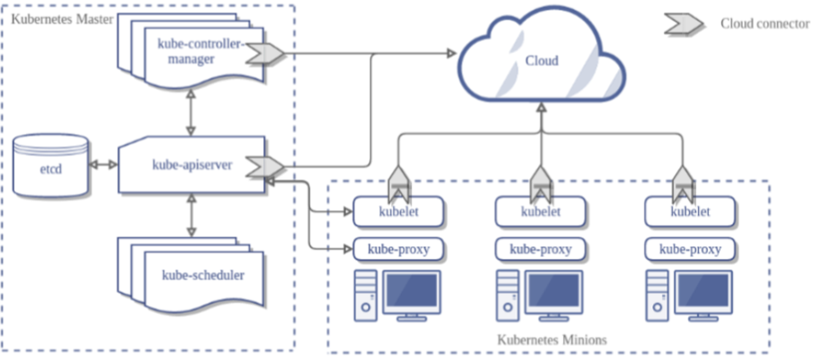

# k8s架构图


# 准备工作
## 使用kubeadm 部署k8集群
- 文档可以参考这个 https://kuboard.cn/install/install-k8s.html
- 出问题可以使用 `kubeadm reset -f` 重置


## 在k8s中部署prometheus

```shell script
# 1.修改pv.yaml中的节点选择器标签 k8s-node01改为你自己的节点
# 在节点上创建数据目录
mkdir -pv /data/prometheus
# 2.监控etcd需要创建 secret
kubectl create secret generic etcd-certs --from-file=/etc/kubernetes/pki/etcd/healthcheck-client.crt --from-file=/etc/kubernetes/pki/etcd/healthcheck-client.key --from-file=/etc/kubernetes/pki/etcd/ca.crt -n kube-system

# 3.部署ksm服务
kubectl apply -f prome_k8s_all_pod/kube-stats-metrics
# 4.部署prometheus
kubectl apply -f prome_k8s_all_pod/
# 5. 访问测试
访问node节点的8091端口 如 http://192.168.0.110:8091/targets
出现下面的target页面并且大部分up为正常
```


## 在k8s中部署grafana
```shell script
# 1. 修改yaml中的节点选择器标签 k8s-node01改为你自己的节点
# 在节点上创建数据目录
mkdir -pv /data/grafana


# 2. 部署grafana
kubectl apply -f grafana/

# 3. 访问测试 访问 node节点的 :30000端口   账户密码 : admin/admin
如 http://192.168.0.110:30000/?orgId=1 
# 4. 添加prometheus数据源，如果prometheus是 hostnetwork的，直接写node的ip:port即可

```


# k8s关注指标分析
k8s中组件复杂，我们主要专注的无外乎四大块指标：容器基础资源指标、k8s资源指标、k8s服务组件指标、部署在pod中业务埋点指标


指标类型 | 采集源 | 应用举例  |发现类型| grafana截图
|  ----  | ----  | ---- | ---- | ---- |
容器基础资源指标 | kubelet 内置cadvisor metrics接口 | 查看容器cpu、mem利用率等 |k8s_sd node级别直接访问node_ip|   |
k8s资源指标 | [kube-stats-metrics](https://github.com/kubernetes/kube-state-metrics) (简称ksm) | 具体可以看<br> 看pod状态如pod waiting状态的原因 <br> 数个数如：查看node pod按namespace分布情况 |通过coredns访问域名|  | 
k8s服务组件指标| 服务组件 metrics接口 | 查看apiserver 、scheduler、etc、coredns请求延迟等 | k8s_sd endpoint级别 |  |
部署在pod中业务埋点指标| pod 的metrics接口 |  依据业务指标场景 | k8s_sd pod级别，访问pod ip的metricspath |


# prometheus为k8s监控做的适配工作

那么prometheus有别于其他时序监控系统在设计之初肯定做了很多适配k8s的工作，我总结一下四点：kubernetes的服务发现、各个组件metrics自暴露+pull采集、采集鉴权的支持、标签relabel能力。下面的表格列举了一下他们的特点。下面我们会详细的分析一下相关配置。

| 适配名字 | 说明 | 举例  |
| ----  | ----  | ---- | 
| k8s服务发现  | 通过watch即时发现资源变化  | `  kubernetes_sd_configs:- role: node` | 
| 各个组件metrics自暴露  | 所有组件将自身指标暴露在各自的服务端口上，prometheus通过pull过来拉取指标 | apiserver:6443/metrics | 
| 鉴权  | k8s的组件接口都是要鉴权的，所以k8s的采集器要支持配置鉴权 | 支持配置token和tls证书 | 
| 标签relabel能力  | 过滤服务发现标的  | `labelmap`去掉服务发现标签的长前缀 |


# 采集分析

## 手动curl访问
```shell script
TOKEN=$(kubectl -n kube-system  get secret $(kubectl -n kube-system  get serviceaccount prometheus -o jsonpath='{.secrets[0].name}') -o jsonpath='{.data.token}' | base64 --decode ) 
curl  https://localhost:6443/metrics --header "Authorization: Bearer $TOKEN" --insecure

```

## k8s组件访问鉴权问题 
- prometheus通过 sa,clusterrolebinding来解决token、证书挂载问题
> sa等配置： prometheus yaml中需要配置对应的saserviceAccountName
```yaml
apiVersion: rbac.authorization.k8s.io/v1 # api的version
kind: ClusterRole # 类型
metadata:
  name: prometheus
rules:
- apiGroups: [""]
  resources: # 资源
  - nodes
  - nodes/proxy
  - services
  - endpoints
  - pods
  verbs: ["get", "list", "watch"] 
- apiGroups:
  - extensions
  resources:
  - ingresses
  verbs: ["get", "list", "watch"]
- nonResourceURLs: ["/metrics"]
  verbs: ["get"]
---
apiVersion: v1
kind: ServiceAccount
metadata:
  name: prometheus # 自定义名字
  namespace: kube-system # 命名空间
---
apiVersion: rbac.authorization.k8s.io/v1
kind: ClusterRoleBinding
metadata:
  name: prometheus
roleRef: # 选择需要绑定的Role
  apiGroup: rbac.authorization.k8s.io
  kind: ClusterRole
  name: cluster-admin
subjects: # 对象
- kind: ServiceAccount
  name: prometheus
  namespace: kube-system

```
> 配置好之后 k8s会将对应文件挂载到pod中
```shell script
/ # ls /var/run/secrets/kubernetes.io/serviceaccount/ -l
total 0
lrwxrwxrwx    1 root     root            13 Jan  7 20:54 ca.crt -> ..data/ca.crt
lrwxrwxrwx    1 root     root            16 Jan  7 20:54 namespace -> ..data/namespace
lrwxrwxrwx    1 root     root            12 Jan  7 20:54 token -> ..data/token
/ # df -h |grep service
tmpfs                     7.8G     12.0K      7.8G   0% /var/run/secrets/kubernetes.io/serviceaccount
/ # 

```
### 手动curl访问
- 配置TOKEN
```shell
TOKEN=$(kubectl -n kube-system  get secret $(kubectl -n kube-system  get serviceaccount prometheus -o jsonpath='{.secrets[0].name}') -o jsonpath='{.data.token}' | base64 --decode )
```
- 访问对应接口，如apiserver
```shell
   curl  https://localhost:6443/metrics --header "Authorization: Bearer $TOKEN" --insecure     |head
      % Total    % Received % Xferd  Average Speed   Time    Time     Time  Current
                                     Dload  Upload   Total   Spent    Left  Speed
      0     0    0     0    0     0      0      0 --:--:-- --:--:-- --:--:--     0# HELP apiserver_audit_event_total [ALPHA] Counter of audit events generated and sent to the audit backend.
    # TYPE apiserver_audit_event_total counter
    apiserver_audit_event_total 0
    # HELP apiserver_audit_requests_rejected_total [ALPHA] Counter of apiserver requests rejected due to an error in audit logging backend.
    # TYPE apiserver_audit_requests_rejected_total counter
    apiserver_audit_requests_rejected_total 0
    # HELP apiserver_client_certificate_expiration_seconds [ALPHA] Distribution of the remaining lifetime on the certificate used to authenticate a request.
    # TYPE apiserver_client_certificate_expiration_seconds histogram
    apiserver_client_certificate_expiration_seconds_bucket{le="0"} 0
    apiserver_client_certificate_expiration_seconds_bucket{le="1800"} 0
    100 36590    0 36590    0     0   194k      0 --:--:-- --:--:-- --:--:--  195k

```
    

## 容器基础资源指标
- 大盘模板 https://grafana.com/grafana/dashboards/13105


```yaml
- job_name: kubernetes-nodes-cadvisor
  honor_timestamps: true
  scrape_interval: 30s
  scrape_timeout: 10s
  metrics_path: /metrics
  kubernetes_sd_configs:
  - role: node
    follow_redirects: true
  scheme: https
  authorization:
    type: Bearer
    credentials_file: /var/run/secrets/kubernetes.io/serviceaccount/token
  tls_config:
    ca_file: /var/run/secrets/kubernetes.io/serviceaccount/ca.crt
    insecure_skip_verify: true
  follow_redirects: true
  relabel_configs:
  - separator: ;
    regex: __meta_kubernetes_node_label_(.+)
    replacement: $1
    action: labelmap
  - separator: ;
    regex: (.*)
    target_label: __metrics_path__
    replacement: /metrics/cadvisor
    action: replace
```


> 下面来解读下
-  代表采用k8s服务发现 node
```yaml
  kubernetes_sd_configs:
  - role: node
```
- 表示服务发现后的node中标签以_meta_kubernetes_node_label_开头的key，替换为后面的字符串，举例`__meta_kubernetes_node_label_kubernetes_io_arch="amd64"` 这组keyv将被替换为 `kubernetes_io_arch="amd64"`
```yaml
  relabel_configs:
      - separator: ;
        regex: __meta_kubernetes_node_label_(.+)
        replacement: $1
        action: labelmap
```


- 表示采集url /metrics 被替换为/metrics/cadvisor
```yaml
  - separator: ;
    regex: (.*)
    target_label: __metrics_path__
    replacement: /metrics/cadvisor
    action: replace
```


## k8s对象资源指标
- grafana 大盘 https://grafana.com/grafana/dashboards/13332

> prometheus 采集配置

```yaml
- job_name: kube-state-metrics
  honor_timestamps: true
  scrape_interval: 30s
  scrape_timeout: 10s
  metrics_path: /metrics
  scheme: http
  static_configs:
  - targets:
    - kube-state-metrics:8080
```

> 下面来解读下

- 接口是http的而且没有鉴权，所以无需配置token和cert
- target这里配置的是 kube-state-metrics:8080

```yaml
  - targets:
    - kube-state-metrics:8080
```

- 因为kube-state-metrics部署好之后有个service

```yaml
apiVersion: v1
kind: Service
metadata:
  labels:
    app.kubernetes.io/name: kube-state-metrics
    app.kubernetes.io/version: v1.9.7
  name: kube-state-metrics
  namespace: kube-system
spec:
  clusterIP: None
  ports:
  - name: http-metrics
    port: 8080
    targetPort: http-metrics
  - name: telemetry
    port: 8081
    targetPort: telemetry
  selector:
    app.kubernetes.io/name: kube-state-metrics

```

- k8s 会为service创建[cordns解析](https://kubernetes.io/zh/docs/concepts/services-networking/dns-pod-service/)，解析域名为 `${service_name}.${namespace}.svc.cluster.local` ,ksm的域名fqdn为 `kube-state-metrics.kube-system.svc.cluster.local`
- pod中的dns配置为search 3个域，所以配置成`kube-state-metrics-kube-system:8080`是可以的，当然也可以配置成`kube-state-metrics.kube-system.svc:8080` `kube-state-metrics.kube-system.svc.cluster.local:8080`

```shell
/ # cat /etc/resolv.conf 
nameserver 10.96.0.10
search kube-system.svc.cluster.local svc.cluster.local cluster.local
options ndots:5

``` 


## k8s服务组件指标
- apiserver大盘 https://grafana.com/grafana/dashboards/12006

>  apiserver prometheus 采集配置其中 etcd集成在apiserver中了
>  kube-controler coredns kube-scheduler等同理

```yaml
- job_name: kubernetes-apiservers
  honor_timestamps: true
  scrape_interval: 30s
  scrape_timeout: 10s
  metrics_path: /metrics
  scheme: https
  kubernetes_sd_configs:
  - role: endpoints
  bearer_token_file: /var/run/secrets/kubernetes.io/serviceaccount/token
  tls_config:
    ca_file: /var/run/secrets/kubernetes.io/serviceaccount/ca.crt
    insecure_skip_verify: false
  relabel_configs:
  - source_labels: [__meta_kubernetes_namespace, __meta_kubernetes_service_name, __meta_kubernetes_endpoint_port_name]
    separator: ;
    regex: default;kubernetes;https
    replacement: $1
    action: keep
```


> 下面来解读下

- endpoint资源是暴露**一个服务的ip地址和port的列表**
- 代表采用k8s服务发现 endpoint，endpoint会非常多，所以需要过滤apiserver的

```yaml
kubernetes_sd_configs:
- role: endpoints
```

- 过滤手段为 标签 __meta_kubernetes_namespace匹配default并且 __meta_kubernetes_service_name 匹配kubernetes 并且 __meta_kubernetes_endpoint_port_name 匹配https，咋样呢 ： `keep`

```yaml
relabel_configs:
- source_labels: [__meta_kubernetes_namespace, __meta_kubernetes_service_name, __meta_kubernetes_endpoint_port_name]
separator: ;
regex: default;kubernetes;https
replacement: $1
action: keep

```

- k8s 会在default namespace中创建apiserver的 service
```shell
$ kubectl get svc -A |grep  443
default         kubernetes                                     ClusterIP   10.96.0.1       <none>        443/TCP                  9d
```

- 最后获取到的endpoint转换为采集路径为： `https://masterip:6443/metrics`


## pod业务埋点指标