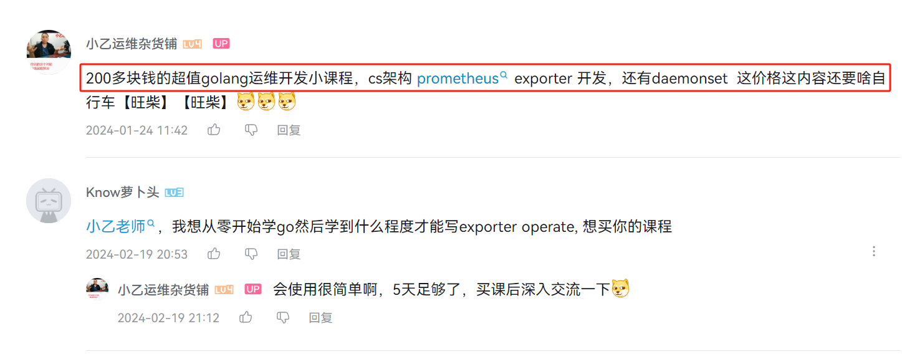

# k8s中的运维开发的10个方向
> 按照k8s的扩展点

| 开发类型                 | k8s的扩展点                                                                                                                                               | 效果演示或简介                                                                                | 学成后的结果                                                                      |
|----------------------|-------------------------------------------------------------------------------------------------------------------------------------------------------|-----------------------------------------------------------------------------------|-----------------------------------------------------------------------------|
| 实战问题+源码解读+二次开发       | [01_【持续更新】从实际问题入手 k8s新源码解读 丰富的实验+开发样例 ](https://haohuo.jinritemai.com/ecommerce/trade/detail/index.html?id=3669946874917421381&origin_type=604)       | [效果演示或简介](https://www.bilibili.com/video/BV13H4y1p7p6/)  | containerd calico源码                                                     |  
| k8s主要组件源码解读     | [02_k8s全组件源码讲解和底层原理分析三合一 助力你成为k8s专家](https://haohuo.jinritemai.com/ecommerce/trade/detail/index.html?id=3595279694125268143&origin_type=604)          | [效果演示或简介](https://www.bilibili.com/video/BV1XJ4m1W7Wr/)  | 组件源码                                                                        |  
| Daemonset开发          | [03_k8s中的网络探测吧，作为写golang的一个小的实战项目](https://haohuo.jinritemai.com/ecommerce/trade/detail/index.html?id=3594920679889365281&origin_type=604)            | [效果演示或简介](https://www.bilibili.com/video/BV1mt4y1K71G/)  | Prometheus-exporter开发 golang-cs架构开发 网络探测                            |
| ingress集群网关          | [04_ingress_k8s流量网关 apisix 高级运维开发课程](https://haohuo.jinritemai.com/ecommerce/trade/detail/index.html?id=3624109749701883834&origin_type=604)          | [效果演示或简介](https://www.bilibili.com/video/BV1qB4y1G7Kf/)  | ingress和apisix使用 ingress-nginx控制器源码 apisix二开 用go开发自己的ingress控制器 |
| webhook              | [05_k8s-webhook动态准入源码解读和实战运维开发课程](https://haohuo.jinritemai.com/ecommerce/trade/detail/index.html?id=3668080939218633019&origin_type=604)             | [效果演示或简介](https://www.bilibili.com/video/BV1Tx421f7Hw/)  | 8个k8s-webhook开发实战案例 tls证书更新问题                                           |
| 调度器扩展                | [06_k8s二次开发之基于真实负载的调度器](https://haohuo.jinritemai.com/ecommerce/trade/detail/index.html?id=3595143844292868583&origin_type=604)                       | [效果演示或简介](https://www.bilibili.com/video/BV1qB4y1G7Kf/)  | PrometheusSdk使用 k8s调度框架源码理解 真实负载和集群利用率                              |
| 多集群管理 故障自愈           | [07_go运维开发实战之k8s多集群自动守卫自愈组件k8s-cluster-guard](https://haohuo.jinritemai.com/ecommerce/trade/detail/index.html?id=3594937597765513838&origin_type=604) | [效果演示或简介](https://www.bilibili.com/video/BV1QV4y1g7za/)  | 多集群管理 常见k8s集群问题和自愈手段                                                    |  
| operator开发           | [08_k8s-operator和crd实战开发 助你成为k8s专家](https://haohuo.jinritemai.com/ecommerce/trade/detail/index.html?id=3595280078524815572&origin_type=604)           | [效果演示或简介](https://www.bilibili.com/video/BV1cv4y1371X/)           | kube-builder使用 基于informer的调谐 workQueue使用                            |
| 企业级实战问题开发            | [09_k8s运维大师课程](https://haohuo.jinritemai.com/ecommerce/trade/detail/index.html?id=3598135830213973305&origin_type=604)                                | [效果演示或简介](https://www.bilibili.com/video/BV11B4y1k7LB/)  | k8s生产集群企业级调优方案 10个k8s中实战运维开发项目                                          |
| web白屏操作(简单)          | [10_k8s管理运维平台实战前端vue后端golang](https://haohuo.jinritemai.com/ecommerce/trade/detail/index.html?id=3596266896661552169&origin_type=604)                 | [效果演示或简介](https://www.bilibili.com/video/BV1QV4y1g7za/)  | vue2.0 k8s-client-go使用 web平台化                                       |  
| web白屏+抽象k8s应用+整合cicd | [11_【持续更新】7模块大运维平台开发-go-vue-k8s-cicd-服务树-监控](https://haohuo.jinritemai.com/ecommerce/trade/detail/index.html?id=3641191333189820599)                  | [效果演示或简介](https://www.bilibili.com/video/BV1BG411B7Qr/)  | vue3.0 k8s-client-go使用 抽象k8s对象 打通cicd灰度发布                       |  

> [【小乙老师强烈推荐的 运维开发年轻人的第一个golang实战练手项目 使用cs架构编写一个k8s中的网络探测daemonset-1】](https://www.bilibili.com/video/BV1BN4y1n79o/?share_source=copy_web&vd_source=170ce3fc32e69133f1182a31ec187b98)
- 

> 购买链接

[【小乙老师强烈推荐的 运维开发年轻人的第一个golang实战练手项目 使用cs架构编写一个k8s中的网络探测daemonset-1】](https://haohuo.jinritemai.com/ecommerce/trade/detail/index.html?id=3594920679889365281&origin_type=604)
