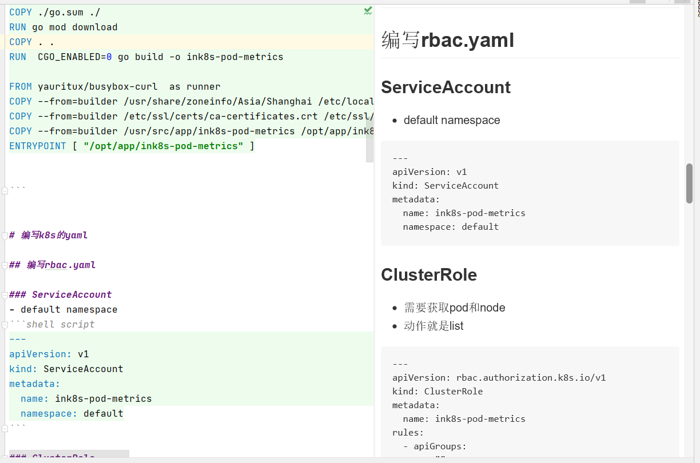
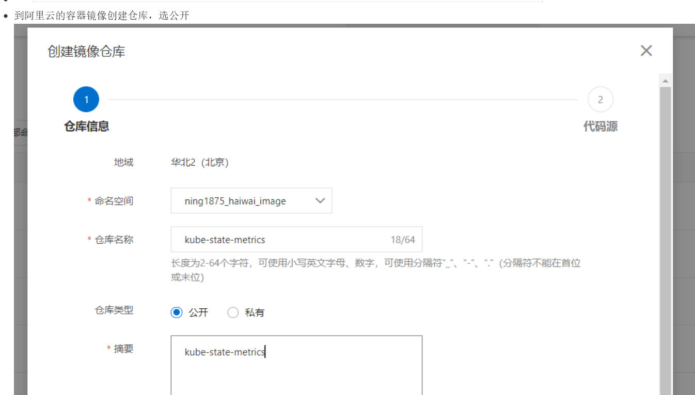

# 这一切的一切仅在这里
- [kube-prometheus和prometheus-operator史诗级教程](https://ke.qq.com/course/3912017?tuin=361e95b0)

# prometheus-guidebook git仓库地址
- [guidebook仓库地址](https://github.com/ning1875/prometheus-guidebook)

# kube-prometheus解决了哪些问题

- 一键化部署k8s-prometheus中的所有组件
- 复杂的k8s采集自动生成
- 内置了很多alert和record rule，专业的promql，不用我们自己写了
- 多级嵌套的record计算如apiserver的slo
- 使用 Prometheus Operator 框架及其自定义资源，使指标的接入可以由业务方自行配置，无需监控管理员介入

# kube-prometheus采集难点

- kube-prometheus内置的k8s采集任务都采集了什么
    - 怎么采集到了
    - 为什么要采集这些
    - 用了哪些优化手段

# kube-prometheus内置的grafana-dashboard看图分析难点

- 内置的grafana-dashboard看图都包含什么图表
    - 为什么要设置这些图表
    - 6层slo预聚合到底怎么做的
- 动态dashboard怎么实现的

# kube-prometheus内置的告警和预聚合分析，6层预聚合slo原理

- 内置的告警包含哪些规则
- 怎么配置上去的
- apiserver6层slo预聚合到底怎么做的
- 我怎样去自定义规则

# kube-rbac 鉴权是干什么的
- 为什么要加着一层
- 和envoy项目什么关系
- 如果代理upstream的流量

# 怎样把我自定义的指标应用到prometheus-operator中

- 如何用go编写项目部署到k8s的pod中
- prometheus原始的k8s_pod_sd怎么采集自定义指标
- 怎样使用serviceMonitor方式接入

# 如何利用阿里云构建国外的镜像

- 为何要关闭代码缓存

# 这一切的一切仅在这里
- [kube-prometheus和prometheus-operator史诗级教程](https://ke.qq.com/course/3912017?tuin=361e95b0)