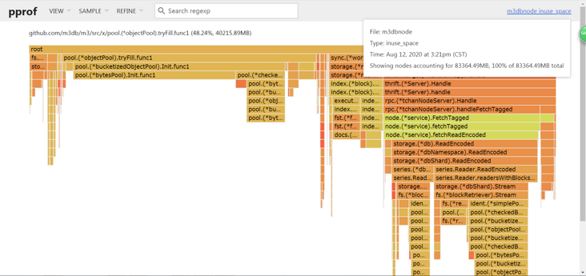
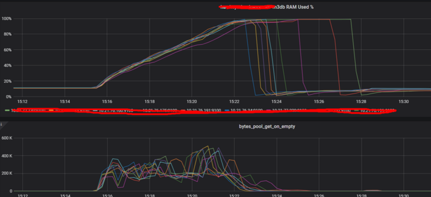
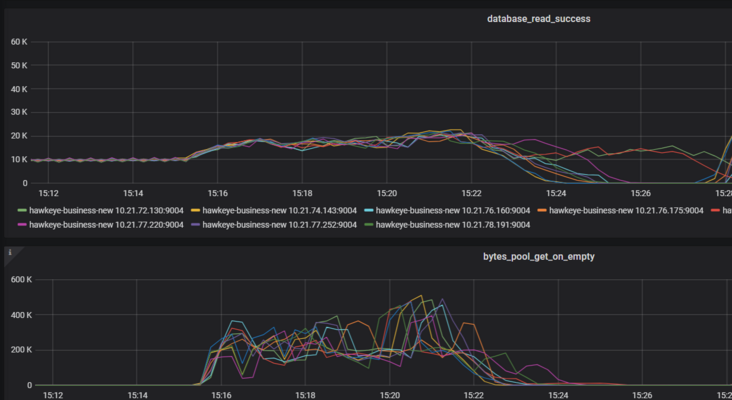
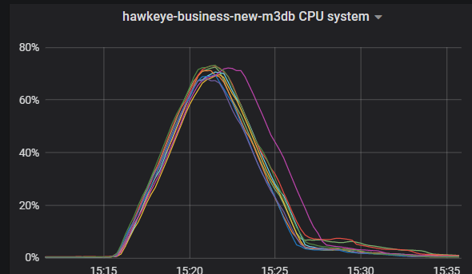
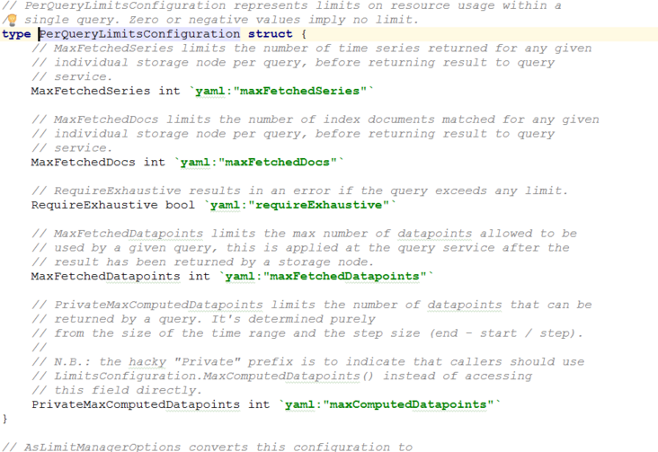

# prometheus本地存储问题
- 参考文档 https://prometheus.io/docs/prometheus/latest/storage/
> Prometheus的本地存储仅限于单个节点的可伸缩性和持久性。Prometheus并没有尝试解决Prometheus本身中的集群存储，而是提供了一组允许与远程存储系统集成的接口。

# 集成方法

> Prometheus通过以下三种方式与远程存储系统集成：

- Prometheus可以将其提取的样本以标准格式写入远程URL。
- Prometheus可以以标准格式从其他Prometheus服务器接收样本。
- Prometheus可以以标准化格式从远程URL读取（返回）样本数据。

> 读取和写入协议都使用基于HTTP的快速压缩协议缓冲区编码
- 该协议尚未被认为是稳定的API，当可以安全地假定Prometheus和远程存储之间的所有跃点都支持HTTP / 2时，该协议将来可能会更改为在HTTP / 2上使用gRPC。


# m3db
## 为什么选它
- 开源免费
- 集群版

## 单机版安装教程
> 过程
- 依赖文件 `m3dbnode` `m3dbnode.service`  `m3dbnode_single.yaml` 
- 执行 `m3db_single_install.sh`

> 注意事项
- 单机版内嵌了etcd进程，如果测试机上有etcd的需要注意下端口冲突
- `m3dbnode`可以选择是否开启内嵌的`m3coordinator`

> 配置文件解读
```yaml


# 是否开启内嵌的 M3Coordinator
coordinator:
  # Address for M3Coordinator to listen for traffic.
  listenAddress: 0.0.0.0:7201
  # 所有m3db namespace(理解为表)都必须列在这里，
  # 如果少了则读写丢数据
  # All configured M3DB namespaces must be listed in this config if running an
  # embedded M3Coordinator instance.
  local:
    namespaces:
      - namespace: default
        type: unaggregated
        retention: 48h

  # M3Coordinator 日志
  logging:
    level: info

  # M3Coordinator metric
  metrics:
    scope:
      # Prefix to apply to all metrics.
      prefix: "coordinator"
    prometheus:
      # Path and address to expose Prometheus scrape endpoint.
      handlerPath: /metrics
      listenAddress: 0.0.0.0:7203 # until https://github.com/m3db/m3/issues/682 is resolved
    sanitization: prometheus
    # Sampling rate for metrics, use 1.0 for no sampling.
    samplingRate: 1.0
    extended: none

  tagOptions:
    # Configuration setting for generating metric IDs from tags.
    idScheme: quoted

db:
  # Minimum log level which will be emitted.
  logging:
    level: info

  # Configuration for emitting M3DB metrics.
  metrics:
    prometheus:
      # Path to expose Prometheus scrape endpoint.
      handlerPath: /metrics
    sanitization: prometheus
    # Sampling rate for metrics, use 1.0 for no sampling.
    samplingRate: 1.0
    extended: detailed

  # 9000 是本实例的 thrift/tchannel接收数据接口
  # Address to listen on for local thrift/tchannel APIs.
  listenAddress: 0.0.0.0:9000
  # 9001 是集群间实例的 thrift/tchannel接收数据接口
  # Address to listen on for cluster thrift/tchannel APIs.
  clusterListenAddress: 0.0.0.0:9001
  # 9002 是本实例的json/http接口 (主要用来debug)
  # Address to listen on for local json/http APIs (used for debugging primarily).
  httpNodeListenAddress: 0.0.0.0:9002
  # Address to listen on for cluster json/http APIs (used for debugging primarily).
  httpClusterListenAddress: 0.0.0.0:9003
  # Address to listen on for debug APIs (pprof, etc).
  debugListenAddress: 0.0.0.0:9004

  # Configuration for resolving the instances host ID.
  hostID:
    # "Config" resolver states that the host ID will be resolved from this file.
    resolver: config
    value: m3db_local

  client:
    # Consistency level for writes.
    writeConsistencyLevel: majority
    # Consistency level for reads.
    readConsistencyLevel: unstrict_majority
    # Timeout for writes.
    writeTimeout: 10s
    # Timeout for reads.
    fetchTimeout: 15s
    # Timeout for establishing a connection to the cluster.
    connectTimeout: 20s
    # Configuration for retrying writes.
    writeRetry:
        initialBackoff: 500ms
        backoffFactor: 3
        maxRetries: 2
        jitter: true
    # Configuration for retrying reads.
    fetchRetry:
        initialBackoff: 500ms
        backoffFactor: 2
        maxRetries: 3
        jitter: true
    # Number of times we background health check for a node can fail before
    # considering the node unhealthy.
    backgroundHealthCheckFailLimit: 4
    backgroundHealthCheckFailThrottleFactor: 0.5

  # Sets GOGC value.
  gcPercentage: 100

  # Whether new series should be created asynchronously (recommended value
  # of true for high throughput.)
  writeNewSeriesAsync: true
  writeNewSeriesBackoffDuration: 2ms

  bootstrap:
    commitlog:
      # Whether tail end of corrupted commit logs cause an error on bootstrap.
      returnUnfulfilledForCorruptCommitLogFiles: false

  cache:
    # Caching policy for database blocks.
    series:
      policy: lru

  commitlog:
    # Maximum number of bytes that will be buffered before flushing the commitlog.
    flushMaxBytes: 524288
    # Maximum amount of time data can remain buffered before flushing the commitlog.
    flushEvery: 1s
    # Configuration for the commitlog queue. High throughput setups may require higher
    # values. Higher values will use more memory.
    queue:
      calculationType: fixed
      size: 2097152

  filesystem:
    # Directory to store M3DB data in.
    filePathPrefix: /opt/app/m3db/data
    # Various fixed-sized buffers used for M3DB I/O.
    writeBufferSize: 65536
    dataReadBufferSize: 65536
    infoReadBufferSize: 128
    seekReadBufferSize: 4096
    # Maximum Mib/s that can be written to disk by background operations like flushing
    # and snapshotting to prevent them from interfering with the commitlog. Increasing
    # this value can make node adds significantly faster if the underlyign disk can
    # support the throughput.
    throughputLimitMbps: 1000.0
    throughputCheckEvery: 128

  # This feature is currently not working, do not enable.
  repair:
    enabled: false
    throttle: 2m
    checkInterval: 1m

  # etcd configuration.
  discovery:
    config:
        service:
            # KV environment, zone, and service from which to write/read KV data (placement
            # and configuration). Leave these as the default values unless you know what
            # you're doing.
            env: default_env
            zone: embedded
            service: m3db
            # Directory to store cached etcd data in.
            cacheDir: /opt/app/m3db/m3kv
            # Configuration to identify the etcd hosts this node should connect to.
            etcdClusters:
                - zone: embedded
                  endpoints:
                      - 127.0.0.1:2379
        # Should only be present if running an M3DB cluster with embedded etcd.
        seedNodes:
            initialCluster:
                - hostID: m3db_local
                  endpoint: http://127.0.0.1:2380


```


## 集群版安装教程
> 过程
- https://m3db.io/docs/cluster/binaries_cluster/

## 和prometheus整合
```shell script
# 在prometheus.yml 添加remote_read/write 段即可
remote_write:
  - url: "http://192.168.0.110:7201/api/v1/prom/remote/write"
remote_read:
  - url: "http://192.168.0.107:7201/api/v1/prom/remote/read"
    read_recent: true

# 在m3dnode上抓包查看
tcpdump -i any tcp dst port 9000 -nn -vv -p -A


```

## 找一个prometheus只做 query ，remote_read m3coor
```shell script
remote_read:
  - url: "http://192.168.0.107:7201/api/v1/prom/remote/read"
    read_recent: true
```

# m3db问题总结
## oom


- 可以参考我写的文章：https://zhuanlan.zhihu.com/p/183815841

### oom时排查
- 内存火焰图: 80G内存
   
- bytes_pool_get_on_empty qps 很高
  
- db read qps增长 80%
   
- node cpu kernel 暴涨
 

**看图结论**
- m3dbnode 内存oom过程很短，很剧烈：总时间不超过7分钟
- 内存从27G增长到250G
- 节点sys态cpu暴涨：因为大量的mem_alloca sys_call
- 内存增长曲线和db_read_qps曲线和bytes_pool_get_on_empty曲线高度吻合
- 内存火焰图： 27G的rpc 40G的pool.(*objectPool).tryFill

### 临时解决办法:限制query资源消耗保护db
- 首先要明确的几点，因为remote_read是链式的调用
- 所以限制m3db前面的组件`prometheus` `m3coordinator`是**没用的**
- 只能限制m3db中关于query的参数，但是这个方法不根治
 
### 上面的方法治标不治本，重要的是解决高基数/重查询的问题

## 其他问题
- 可以参考我写的文章：https://zhuanlan.zhihu.com/p/359551116

### 正常情况下m3db 对io要求不高
- 因为和prometheus一样设计时采用了`mmap`等技术，所以没必要采用ssd
- 和open-falcon/夜莺等采用rrd不同，rrd 单指标单文件，很耗io

### cpu和内存开销
- 写峰很危险，原因很简单
    - 一条新的数据写入的时候，需要申请block，索引等一系列内存，伴随着cpu开销
    - 但是如果没有新的数据，只是不断的写入点，那么只涉及到点的append追加，则开销较小
    - 所以在突发的写峰对于tsdb来说就是危险，比如auto_scaling
    - 最理想的情况就是100w条数据，都是平稳的没有变化的持续追加点写入
    - 但是在容器中不现实，因为每次pod滚动都涉及 id等唯一值的变化
    
- 读峰也很危险，原因如下
    - m3db默认内置lru会缓存查询的block等，这个为了一个典型的场景
    - 就是一个dashboard查出来后点刷新时间，除了时间其他查询tag没变化，这种lru能应付的很好
    - 但是对于高基数的查询来说，lru的意义就不大了
    - 而且会涉及到读取放大的问题，假设1w基数需要100M内存，则100w基数需要10G内存
         
### m3db bootstrap速度问题
- 在节点oom或其他原因导致的重启中，bootstrap速度决定了节点多久能提供服务
- bootstrap速度和`namespace 数量正相关`，和`数据量大小正相关`
- 而且会优先提供写服务，避免长时间不能写入数据造成断点
- 而且再重启时 会有大量读盘操作，基本能把io打满(*因为需要将磁盘中的部分数据缓存到内存中*)


### 不要直接在m3coordinator 中开启聚合
- 我们知道直接在m3coordinator中配置 `type: aggregated`的namespace是可以直接开启聚合的
- 但是[官方文档](https://m3db.io/docs/how_to/aggregator) 说的很清楚了 
```shell script
The M3 Coordinator also performs this role but is not cluster aware.
This means metrics will not get aggregated properly if you send metrics in round robin fashion to multiple M3 Coordinators for the same metrics ingestion source (e.g. Prometheus server).
```
- 因为数据按照轮询模式打过来到m3coordinator上，导致同一个指标的不同时刻数据可能出现在多个m3coordinator上，聚合出来的结果就是错的

