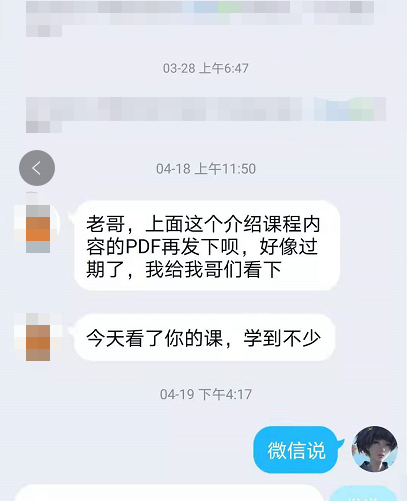
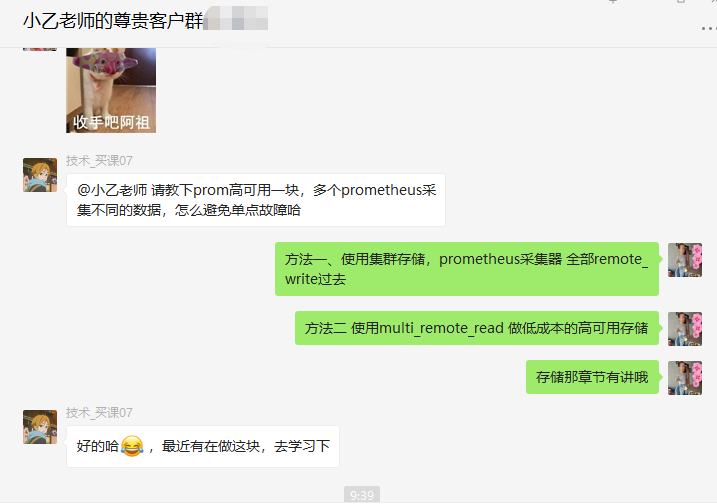
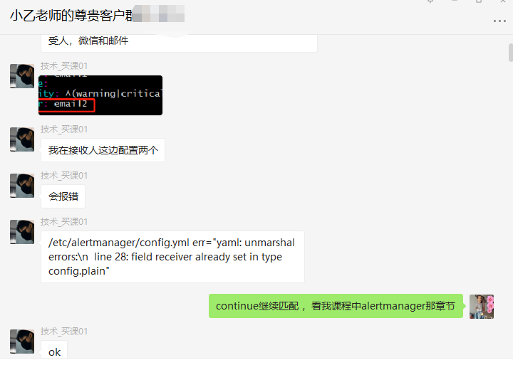
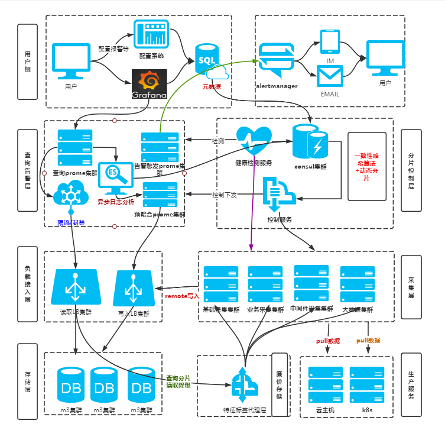
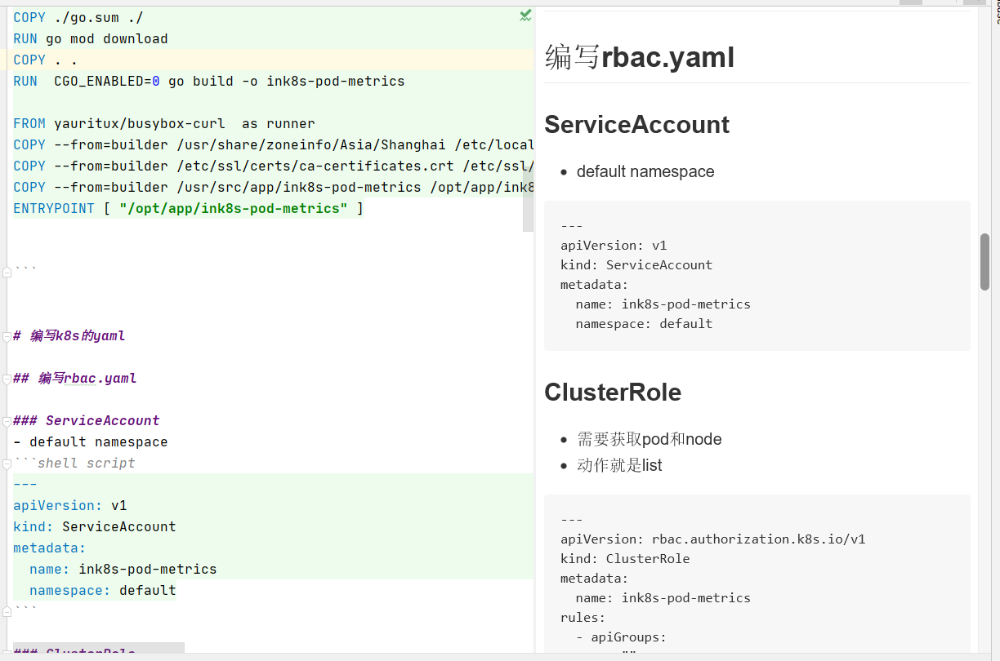
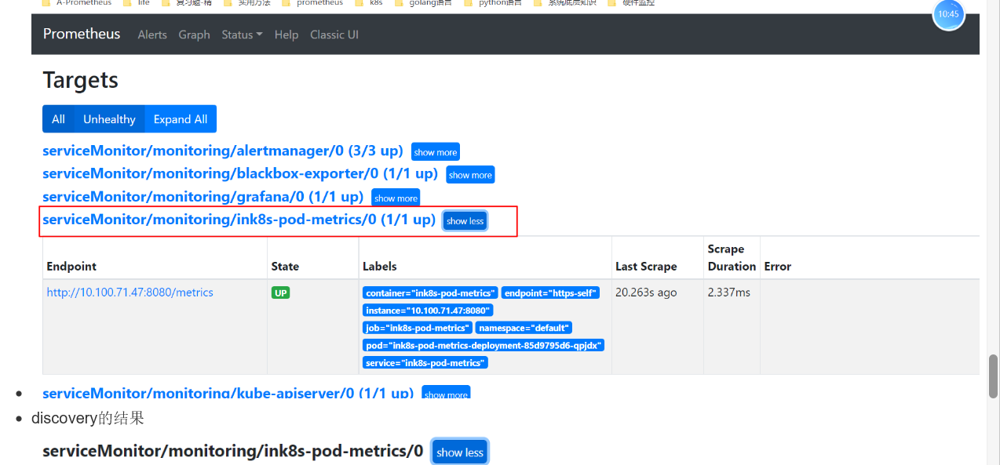

# k8s教程说明
- [k8s底层原理和源码讲解之精华篇](https://ke.qq.com/course/4093533)

# 项目说明
> prometheus全组件的教程

- [01_prometheus全组件配置使用、底层原理解析、高可用实战](https://ke.qq.com/course/3549215?tuin=361e95b0)
- [02_prometheus-thanos使用和源码解读](https://ke.qq.com/course/3883439?tuin=361e95b0)
- [03_kube-prometheus和prometheus-operator实战和原理介绍](https://ke.qq.com/course/3912017?tuin=361e95b0)

> 关于白嫖和付费
- 白嫖当然没关系，我已经贡献了很多文章和开源项目，当然还有免费的视频
- 但是客观的讲，如果你能力超强是可以一直白嫖的，可以看源码。什么问题都可以解决
- 看似免费的资料很多，但大部分都是边角料，核心的东西不会免费，更不会有大神给你答疑
- thanos和kube-prometheus如果你对prometheus源码把控很好的话，再加上k8s知识的话就觉得不难了

> 付费后看看大家的反馈

# 01 prometheus付费基础课程
- 课程链接：[prometheus全组件配置使用、底层原理解析、高可用实战](https://ke.qq.com/course/3549215?tuin=361e95b0)

## 付费课程介绍

1. 学完这个课程，你可以可以搭建如下架构哦

2. 门课目标用户收益
    - 一线运维人员：学习使用、熟悉配置、掌握调优、升职加薪
        - 可以从头到尾熟悉prometheus、各种exporter、alertmanager、grafana、m3db、loki等组件的使用配置
        - 熟悉主流exporter(中间件、存储)的告警表达式配置
        - 同时能掌握相关组件调优的经验
        
    - 运维开发人员：学习高性能原理，可助⼒斩获⼤⼚监控运维开发offer
        - 从源码级别了解prometheus高性能的设计方案
        - 掌握二次开发相关组件的能力
        - 了解分布式系统高可用改造方案

# 02 prometheus-thanos 付费课程
- 课程链接 [prometheus-thanos使用和源码解读](https://ke.qq.com/course/3883439?tuin=361e95b0)

## thanos课程介绍
- [01_thanos源码级别教程地址](./thanos课程.md)

# 03 kube-prometheus和prometheus-operator付费课程
- 课程链接 [kube-prometheus和prometheus-operator实战和原理介绍](https://ke.qq.com/course/3912017?tuin=361e95b0)
- 截图

## kube-prometheus和prometheus-operator教程介绍
- [01_kube-prometheus和prometheus-operator教程](./kube-prometheus课程.md)

# 04 免费课程目录导航
- [01 prometheus采集k8s底层原理](./prometheus免费课程/01_prometheus适配k8s采集.md)
- [02 k8s监控指标讲解](./prometheus免费课程/02_k8s监控指标讲解.md)
- [03 时序监控集群存储m3db](./prometheus免费课程/03_时序监控集群存储m3db.md)
- [04 低成本multi_remote_read方案](./prometheus免费课程/04_低成本multi_remote_read方案.md)

## 免费课程链接
- 课程链接：[prometheus为了适配k8s监控的改造，高可用时序监控存储实战](https://ke.qq.com/course/3517990?taid=12068265399791142&tuin=361e95b0)