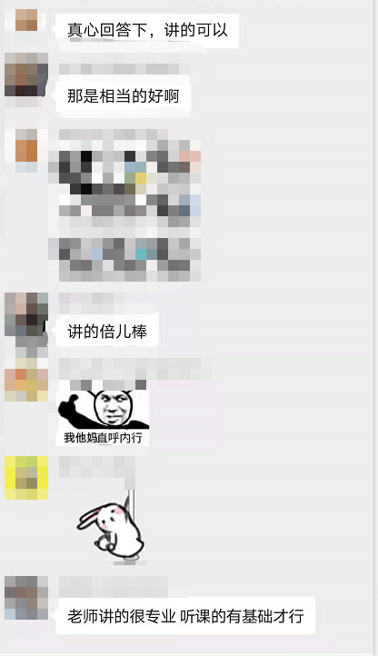
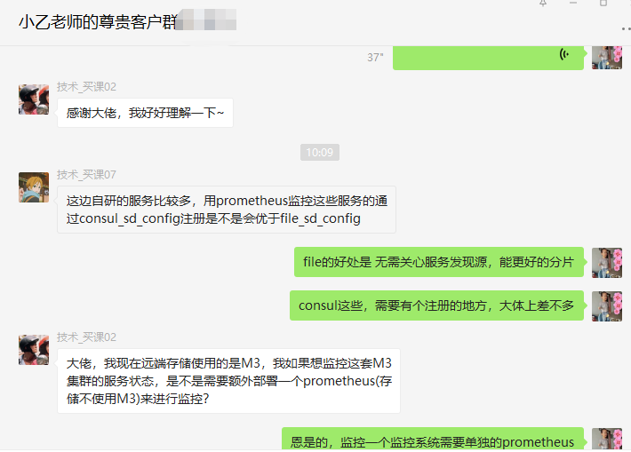
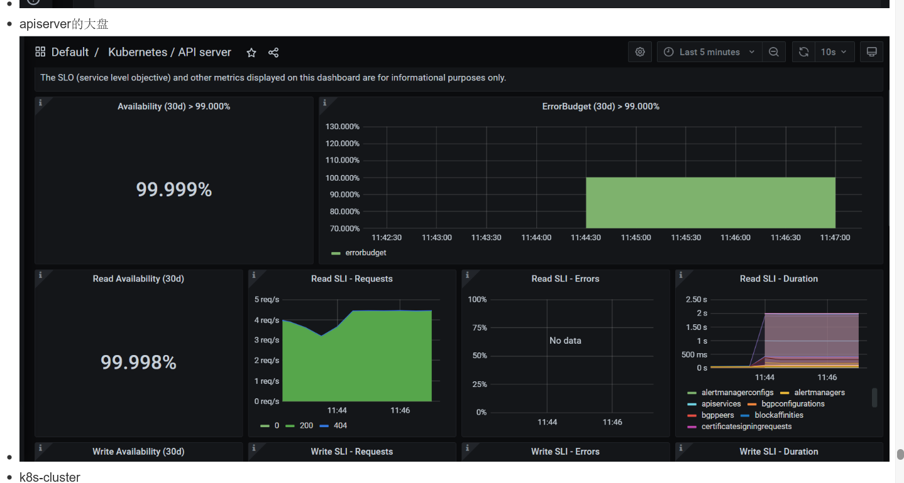

`# 运维目前3大核心方向 想成为和我一样的专家么 经验分享给你

# 目前运维的3个火热的方向 : k8s、监控、cicd

- [分析视频链接](https://www.bilibili.com/video/BV1pL4y1A7ST)
- 无论是否直接维护开发这3大类工具，都必须要求我们对这些比较熟悉

## 为什么现在k8s相关岗位火热，给钱多

-因为k8s的出现给公司省钱
- 

- 大幅降低公司的机器成本和开发效率成本
- 所以市场上对k8s人才的需求是巨大的

## 到这里我们可以得到1个结论就是

- 对运维来说k8s已经是必备技能 而非加分项
- [分析视频链接](https://www.bilibili.com/video/BV1Mg41127s3/)

## 同时监控和cicd可以作为k8s的附属项目

# 那么作为运维的我们 怎么进阶到这3大核心方向呢

- 听我给你们规划一个完整的学习路线

## k8s要先入门 会运维操作

- 

### [k8s零基础入门课程链接](https://ke.qq.com/course/5829699)

- [k8s零基础入门课程链接](https://ke.qq.com/course/5829699)

### 大致包含下面几部分

- 01 集群安装和认识集群组件
- 02 安装必要的控制台/监控/日志等组件
- 03 kubectl 常见操作
- 04 容器相关操作如exec 查看日志等
- 05 常见控制器(dep/ds/sts/job)的操作
- 06 k8s 存储对象源码解读
- 07 k8s网络相关Service和ingress

## 然后这时候老板让你帮助 业务上云 上k8s，所以你需要学习一下怎么做cicd，怎么写dockerFile ，怎么部署到k8s集群中

### cicd实战

| 学习方向                                                                 | 分析进阶视频        | 备注  | 
|----------------------------------------------------------------------|---------|-----------|
| [01_tekton全流水线实战和pipeline运行原理源码解读](https://ke.qq.com/course/5458555) | [地址](https://www.bilibili.com/video/BV13P4y1Z7Xv/)  | 	     |  

- 

## 在维护了一段时间k8s集群后发现 prometheus监控的基础并不牢靠

- 需要从基础到进阶好好学习一下prometheus

### prometheus监控从入门到专家之路

| 学习方向                                                                              | 分析进阶视频  | 备注  | 
|-----------------------------------------------------------------------------------|---------|-----|
| [01_prometheus零基础入门，grafana基础操作，主流exporter采集配置](https://ke.qq.com/course/5826832) | [地址](https://www.bilibili.com/video/BV1814y1e73y/)  | 	    |     |  
| [02_prometheus全组件配置使用、底层原理解析、高可用实战](https://ke.qq.com/course/3549215)             | [地址](https://www.bilibili.com/video/BV1oZ4y1f7au/)  |      |  
| [03_kube-prometheus和prometheus-operator实战和原理介绍](https://ke.qq.com/course/3912017) | [地址](https://www.bilibili.com/video/BV1LR4y1L7jV/)  | 	 |  
| [04_prometheus-thanos使用和源码解读](https://ke.qq.com/course/3883439)                   | [地址](https://www.bilibili.com/video/BV1814y1e73y/)  | 	   |  
| [05_prometheus源码讲解和二次开发](https://ke.qq.com/course/4236995)                        | [地址](https://www.bilibili.com/video/BV1hS4y1m73Q/)  | 	    |  
| [06_prometheus监控k8s的实战配置和原理讲解，写go项目暴露业务指标](https://ke.qq.com/course/5837369)                        | [地址](https://www.bilibili.com/video/BV1mW4y1Y7AU/)  | 	    |  

## 然后发现缺乏对k8s源码的了解 导致排查不了复杂的问题：所以必须要恶补一下go语言知识

### golang运维开发之从0基础到运维平台

| 学习方向                                              | 分析进阶视频  | 备注   | 
|---------------------------------------------------|---------|------|
| [01_golang基础课程](https://ke.qq.com/course/4334898) | [地址](https://www.bilibili.com/video/BV1WT411M7Gh/)  |      |  
| [02_golang运维平台实战，服务树,日志监控，任务执行，分布式探测](https://ke.qq.com/course/4334675)             | [地址](https://www.bilibili.com/video/BV14T4y1k7oo)  |      |  
| [03_golang运维开发实战课程之k8s巡检平台](https://ke.qq.com/course/5818923)                       | [地址](https://www.bilibili.com/video/BV1Ad4y1r7C4/)  |      |  

## 有了go基础之后就可以 畅快的阅读k8s源码

### k8s从零基础入门到专家到运维大师

- 

| 学习方向                                              | 分析进阶视频  | 备注  | 
|---------------------------------------------------|---------|-----|
| [01_k8s零基础入门实战](https://ke.qq.com/course/5829699) | [地址](https://www.bilibili.com/video/BV1Mt4y1P7bL/)  |       |  
| [02_k8s纯源码解读课程，助力你变成k8s专家](https://ke.qq.com/course/4697341)                          | [地址](https://www.bilibili.com/video/BV1or4y1877p/)  |       |  
| [03_k8s底层原理和源码讲解之精华篇](https://ke.qq.com/course/4093533)                              | [地址](https://www.bilibili.com/video/BV1T34y127gU/)  |       |  
| [04_k8s底层原理和源码讲解之进阶篇](https://ke.qq.com/course/4236389)                              | [地址](https://www.bilibili.com/video/BV1si4y1f7Xo/)  |     |  

- 

## 有了k8s源码的基础的你，这时候开始摩拳擦掌 想做一些k8s开发工作了

### k8s 开发篇

| 学习方向                                                                            | 分析进阶视频  | 备注  | 
|---------------------------------------------------------------------------------|---------|------------|
| [01_k8s运维大师课程](https://ke.qq.com/course/5586848)                                | [地址](https://www.bilibili.com/video/BV11B4y1k7LB/)  |     |  
| [02_k8s-operator和crd实战开发 助你成为k8s专家](https://ke.qq.com/course/5458555)           | [地址](https://www.bilibili.com/video/BV1cv4y1371X/)  |         |  
| [03_k8s二次开发之基于真实负载的调度器](https://ke.qq.com/course/5814034)                       | [地址](https://www.bilibili.com/video/BV1qB4y1G7Kf/)  |       |  
| [04_go运维开发实战之k8s多集群自动守卫自愈组件k8s-cluster-guard](https://ke.qq.com/course/5925095) | [地址](https://www.bilibili.com/video/BV1QV4y1g7za/)  |       |  
| [05_k8s管理运维平台实战前端vue后端golang](https://ke.qq.com/course/5856444)                 | [地址](https://www.bilibili.com/video/BV1QV4y1g7za/)  |       |  
| [06_k8s中的网络探测吧，作为写golang的一个小的实战项目](https://ke.qq.com/course/5860635)                 | [地址](https://www.bilibili.com/video/BV1mt4y1K71G/)  |       |  

### k8s调优
- [01_k8s集群调优小课程](https://ke.qq.com/course/5877885)
- [02_k8s运维大师课程](https://ke.qq.com/course/5586848)

- 

# 如果全部学习完成之后就会发现 可以无障碍阅读许多k8s周边的go 开源项目了

# 并且可以 修改其中源码进行二次开发，或者借鉴其中的逻辑自由的开发组件了

# 零基础学习路线：
- 先golang零基础 [01_golang基础课程](https://ke.qq.com/course/4334898)
- 再k8s零基础 [01_k8s零基础入门实战](https://ke.qq.com/course/5829699)
- 再prometheus零基础 [01_k8s零基础入门实战](https://ke.qq.com/course/5829699)
- 再k8s中的网络探测吧，作为写golang的一个小的实战项目 [06_k8s中的网络探测吧，作为写golang的一个小的实战项目](https://ke.qq.com/course/5860635)
- 再k8s调优 [01_k8s集群调优小课程](https://ke.qq.com/course/5877885)
- 再  [06_prometheus监控k8s的实战配置和原理讲解，写go项目暴露业务指标](https://ke.qq.com/course/5837369)
- 再  [03_golang运维开发实战课程之k8s巡检平台](https://ke.qq.com/course/5818923)
- 再 [02_k8s纯源码解读课程，助力你变成k8s专家](https://ke.qq.com/course/4697341)
- 再 [03_k8s底层原理和源码讲解之精华篇](https://ke.qq.com/course/4093533)
- 再 [04_k8s底层原理和源码讲解之进阶篇](https://ke.qq.com/course/4236389)
> 最后再 做k8s中的二次开发
- [01_k8s运维大师课程](https://ke.qq.com/course/5586848)                                | [地址](https://www.bilibili.com/video/BV11B4y1k7LB/)  |     |
- [02_k8s-operator和crd实战开发 助你成为k8s专家](https://ke.qq.com/course/5458555)           | [地址](https://www.bilibili.com/video/BV1cv4y1371X/)  |         |
- [03_k8s二次开发之基于真实负载的调度器](https://ke.qq.com/course/5814034)                       | [地址](https://www.bilibili.com/video/BV1qB4y1G7Kf/)  |       |
- [04_go运维开发实战之k8s多集群自动守卫自愈组件k8s-cluster-guard](https://ke.qq.com/course/5925095) | [地址](https://www.bilibili.com/video/BV1QV4y1g7za/)  |       |
- [05_k8s管理运维平台实战前端vue后端golang](https://ke.qq.com/course/5856444)                 | [地址](https://www.bilibili.com/video/BV1QV4y1g7za/)  |       |

# 有golang基础的想往k8s运维开发进阶走的
- 再k8s中的网络探测吧，作为写golang的一个小的实战项目 [06_k8s中的网络探测吧，作为写golang的一个小的实战项目](https://ke.qq.com/course/5860635)
- [02_golang运维平台实战，服务树,日志监控，任务执行，分布式探测](https://ke.qq.com/course/4334675)             | [地址](https://www.bilibili.com/video/BV14T4y1k7oo)  |      |

- [01_k8s运维大师课程](https://ke.qq.com/course/5586848)                                | [地址](https://www.bilibili.com/video/BV11B4y1k7LB/)  |     |
- [02_k8s-operator和crd实战开发 助你成为k8s专家](https://ke.qq.com/course/5458555)           | [地址](https://www.bilibili.com/video/BV1cv4y1371X/)  |         |
- [03_k8s二次开发之基于真实负载的调度器](https://ke.qq.com/course/5814034)                       | [地址](https://www.bilibili.com/video/BV1qB4y1G7Kf/)  |       |
- [04_go运维开发实战之k8s多集群自动守卫自愈组件k8s-cluster-guard](https://ke.qq.com/course/5925095) | [地址](https://www.bilibili.com/video/BV1QV4y1g7za/)  |       |
- [05_k8s管理运维平台实战前端vue后端golang](https://ke.qq.com/course/5856444)                 | [地址](https://www.bilibili.com/video/BV1QV4y1g7za/)  |       |

# 直播答疑sre职业发展规划
- [k8s-prometheus课程答疑和运维开发职业发展规划](https://ke.qq.com/course/5506477)

# 关于白嫖和付费
- 白嫖当然没关系，我已经贡献了很多文章和开源项目，当然还有免费的视频
- 但是客观的讲，如果你能力超强是可以一直白嫖的，可以看源码。什么问题都可以解决
- 看似免费的资料很多，但大部分都是边角料，核心的东西不会免费，更不会有大神给你答疑
- thanos和kube-prometheus如果你对prometheus源码把控很好的话，再加上k8s知识的话就觉得不难了

# 付费后看看大家的反馈

# 01 prometheus付费基础课程
- 课程链接：[prometheus全组件配置使用、底层原理解析、高可用实战](https://ke.qq.com/course/3549215?tuin=361e95b0)

## 付费课程介绍

1. 学完这个课程，你可以可以搭建如下架构哦

2. 门课目标用户收益
    - 一线运维人员：学习使用、熟悉配置、掌握调优、升职加薪
        - 可以从头到尾熟悉prometheus、各种exporter、alertmanager、grafana、m3db、loki等组件的使用配置
        - 熟悉主流exporter(中间件、存储)的告警表达式配置
        - 同时能掌握相关组件调优的经验
        
    - 运维开发人员：学习高性能原理，可助⼒斩获⼤⼚监控运维开发offer
        - 从源码级别了解prometheus高性能的设计方案
        - 掌握二次开发相关组件的能力
        - 了解分布式系统高可用改造方案

# 02 prometheus-thanos 付费课程
- 课程链接 [prometheus-thanos使用和源码解读](https://ke.qq.com/course/3883439?tuin=361e95b0)

## thanos课程介绍
- [01_thanos源码级别教程地址](./thanos课程.md)

# 03 kube-prometheus和prometheus-operator付费课程
- 课程链接 [kube-prometheus和prometheus-operator实战和原理介绍](https://ke.qq.com/course/3912017?tuin=361e95b0)
- 截图

## kube-prometheus和prometheus-operator教程介绍
- [01_kube-prometheus和prometheus-operator教程](./kube-prometheus课程.md)

# 04 免费课程目录导航
- [01 prometheus采集k8s底层原理](./prometheus免费课程/01_prometheus适配k8s采集.md)
- [02 k8s监控指标讲解](./prometheus免费课程/02_k8s监控指标讲解.md)
- [03 时序监控集群存储m3db](./prometheus免费课程/03_时序监控集群存储m3db.md)
- [04 低成本multi_remote_read方案](./prometheus免费课程/04_低成本multi_remote_read方案.md)

## 免费课程链接
- 课程链接：[prometheus为了适配k8s监控的改造，高可用时序监控存储实战](https://ke.qq.com/course/3517990?taid=12068265399791142&tuin=361e95b0)