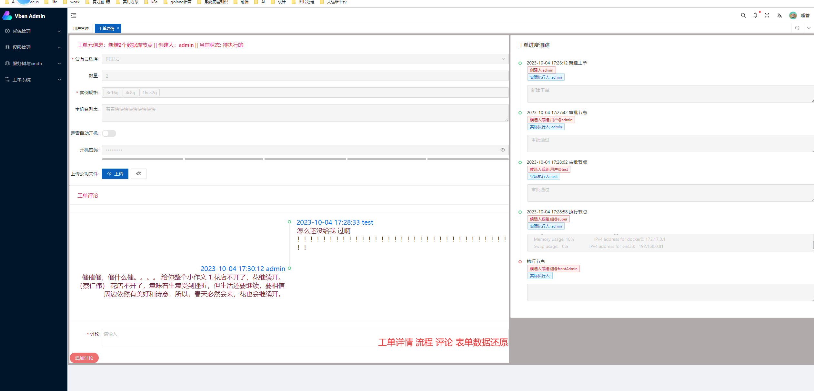
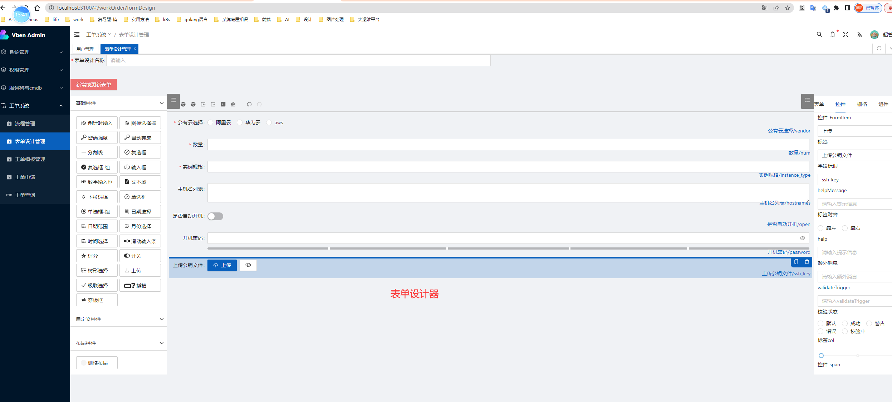
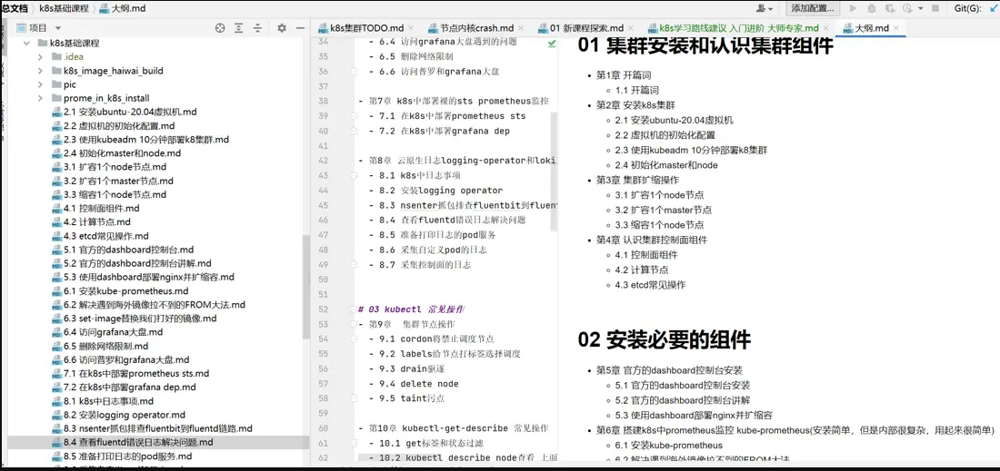

# 主推课程购课链接和介绍视频

# 【新课程】aiInfra大模型aiOnK8s-gpu训练-volcano调度-cilium-ebpf源码解析
- 

> 新课程gpu和ebpf课程涉及开源项目的源码解读
 

> 购买链接

基于k8s-thanos的Prometheus监控实战-调优-源码解读-二次开发

| 开发类型                                                                   | k8s的扩展点                                                                                                                                                             | 效果演示或简介                                                 | 学成后的结果                                                                      |
|------------------------------------------------------------------------|---------------------------------------------------------------------------------------------------------------------------------------------------------------------|---------------------------------------------------------|-----------------------------------------------------------------------------|
| 【新课程】aiInfra大模型aiOnK8s-gpu训练-volcano调度-cilium-ebpf源码解析                 | [ 【新课程】aiInfra大模型aiOnK8s-gpu训练-volcano调度-cilium-ebpf源码解析 ](https://haohuo.jinritemai.com/ecommerce/trade/detail/index.html?id=3696623728575250607&origin_type=604)  | [效果演示或简介](https://www.bilibili.com/video/BV1kT42167d2) | 赶上大模型 ai-gpu训练的风口，末班车                                                       |  
| 【新课程】基于k8s-thanos的Prometheus监控实战-调优-源码解读-二次开发                          | [ 【新课程】基于k8s-thanos的Prometheus监控实战-调优-源码解读-二次开发](https://haohuo.jinritemai.com/ecommerce/trade/detail/index.html?id=3698145454832353583&origin_type=604)  | [效果演示或简介](https://www.bilibili.com/video/BV1KVvCe2Evu/) | k8s prometheus-operator监控 thanos                                             |  
| 【持续更新】8模块大运维平台开发-go-vue-k8s-cicd-服务树-监控-数据库   web白屏+抽象k8s应用+整合cicd | [11_【持续更新】8模块大运维平台开发-go-vue-k8s-cicd-服务树-监控](https://haohuo.jinritemai.com/ecommerce/trade/detail/index.html?id=3641191333189820599&origin_type=604)                | [效果演示或简介](https://www.bilibili.com/video/BV1BG411B7Qr/) | vue3.0 k8s-client-go使用 抽象k8s对象 打通cicd灰度发布                       |  
| 1对1 私有解决方案，不限问题，自由答疑，带你写代码分析问题                                         | [ 【VIP1对1视频直播连麦】解决你真实工作问题 带你开发并提供源码 自由提问 手把手带你学习进步 ](https://haohuo.jinritemai.com/ecommerce/trade/detail/index.html?id=3690461008750576095&origin_type=604)        | https://www.bilibili.com/video/BV1Us421T77a/            | https://www.bilibili.com/video/BV1QH4y1V7pY                                 |  
| 在线离线混部-潮汐调度开发-k8s大集群资源利用率提升                                            | [ 【第8模块】数据库管理平台【mysqlOnK8s】【主从 备份 读写】 ](https://haohuo.jinritemai.com/ecommerce/trade/detail/index.html?id=3686654675488211174&origin_type=604)                     | https://www.bilibili.com/video/BV17E4m1R7Ym/            | https://www.bilibili.com/video/BV1QH4y1V7pY                                 |  
| 在线离线混部-潮汐调度开发-k8s大集群资源利用率提升                                            | [ 【持续更新】在线离线混部-潮汐调度开发-k8s大集群资源利用率提升 ](https://haohuo.jinritemai.com/ecommerce/trade/detail/index.html?id=3680148583925023059&origin_type=604)                       | [效果演示或简介](https://www.bilibili.com/video/BV13H4y1p7p6/) | https://www.bilibili.com/video/BV1QH4y1V7pY                                 |  
| 实战问题+源码解读+二次开发                                                         | [01_【持续更新】从实际问题入手 k8s新源码解读 丰富的实验+开发样例 ](https://haohuo.jinritemai.com/ecommerce/trade/detail/index.html?id=3669946874917421381&origin_type=604)                     | [效果演示或简介](https://www.bilibili.com/video/BV13H4y1p7p6/) | containerd calico源码                                                     |  
| k8s主要组件源码解读                                                            | [02_k8s全组件源码讲解和底层原理分析三合一 助力你成为k8s专家](https://haohuo.jinritemai.com/ecommerce/trade/detail/index.html?id=3595279694125268143&origin_type=604)                        | [效果演示或简介](https://www.bilibili.com/video/BV1XJ4m1W7Wr/) | 组件源码                                                                        |  
| Daemonset开发                                                            | [03_k8s中的网络探测吧，作为写golang的一个小的实战项目](https://haohuo.jinritemai.com/ecommerce/trade/detail/index.html?id=3594920679889365281&origin_type=604)                          | [效果演示或简介](https://www.bilibili.com/video/BV1mt4y1K71G/) | Prometheus-exporter开发 golang-cs架构开发 网络探测                            |
| ingress集群网关                                                            | [04_ingress_k8s流量网关 apisix 高级运维开发课程](https://haohuo.jinritemai.com/ecommerce/trade/detail/index.html?id=3624109749701883834&origin_type=604)                        | [效果演示或简介](https://www.bilibili.com/video/BV1qB4y1G7Kf/) | ingress和apisix使用 ingress-nginx控制器源码 apisix二开 用go开发自己的ingress控制器 |
| webhook                                                                | [05_k8s-webhook动态准入源码解读和实战运维开发课程](https://haohuo.jinritemai.com/ecommerce/trade/detail/index.html?id=3668080939218633019&origin_type=604)                           | [效果演示或简介](https://www.bilibili.com/video/BV1Tx421f7Hw/) | 8个k8s-webhook开发实战案例 tls证书更新问题                                           |
| 调度器扩展                                                                  | [06_k8s二次开发之基于真实负载的调度器](https://haohuo.jinritemai.com/ecommerce/trade/detail/index.html?id=3595143844292868583&origin_type=604)                                     | [效果演示或简介](https://www.bilibili.com/video/BV1qB4y1G7Kf/) | PrometheusSdk使用 k8s调度框架源码理解 真实负载和集群利用率                              |
| 多集群管理 故障自愈                                                             | [07_go运维开发实战之k8s多集群自动守卫自愈组件k8s-cluster-guard](https://haohuo.jinritemai.com/ecommerce/trade/detail/index.html?id=3594937597765513838&origin_type=604)               | [效果演示或简介](https://www.bilibili.com/video/BV1QV4y1g7za/) | 多集群管理 常见k8s集群问题和自愈手段                                                    |  
| operator开发                                                             | [08_k8s-operator和crd实战开发 助你成为k8s专家](https://haohuo.jinritemai.com/ecommerce/trade/detail/index.html?id=3595280078524815572&origin_type=604)                         | [效果演示或简介](https://www.bilibili.com/video/BV1cv4y1371X/) | kube-builder使用 基于informer的调谐 workQueue使用                            |
| 企业级实战问题开发                                                              | [09_k8s运维大师课程](https://haohuo.jinritemai.com/ecommerce/trade/detail/index.html?id=3598135830213973305&origin_type=604)                                              | [效果演示或简介](https://www.bilibili.com/video/BV11B4y1k7LB/) | k8s生产集群企业级调优方案 10个k8s中实战运维开发项目                                          |
| web白屏操作(简单)                                                            | [10_k8s管理运维平台实战前端vue后端golang](https://haohuo.jinritemai.com/ecommerce/trade/detail/index.html?id=3596266896661552169&origin_type=604)                               | [效果演示或简介](https://www.bilibili.com/video/BV1QV4y1g7za/) | vue2.0 k8s-client-go使用 web平台化                                       |  
| web白屏+抽象k8s应用+整合cicd                                                   | [11_【持续更新】7模块大运维平台开发-go-vue-k8s-cicd-服务树-监控](https://haohuo.jinritemai.com/ecommerce/trade/detail/index.html?id=3641191333189820599&origin_type=604)                | [效果演示或简介](https://www.bilibili.com/video/BV1BG411B7Qr/) | vue3.0 k8s-client-go使用 抽象k8s对象 打通cicd灰度发布                       |  

# 【给k8s和go开发新手的】推荐几个运维golang运维开发练手项目

| 课程名称                                                                                                                                                                                           | 推荐理由                                                                                 | 介绍视频                                                                    |
|------------------------------------------------------------------------------------------------------------------------------------------------------------------------------------------------|--------------------------------------------------------------------------------------|-------------------------------------------------------------------------|
| [【小乙老师强烈推荐的 运维开发年轻人的第一个golang实战练手项目 使用cs架构编写一个k8s中的网络探测daemonset-1】 ](https://haohuo.jinritemai.com/ecommerce/trade/detail/index.html?id=3594920679889365281&origin_type=605&pd_hide_footer=1) | 200多块钱的超值golang运维开发小课程 cs架构 prometheus exporter 开发 还有daemonset 这价格这内容还要啥自行车  | https://b23.tv/xk5Ycad                                                  |
| [ 【小乙老师给k8s运维强烈推荐的k8s网关运维平台高级课程 apisix ingress实战和源码解读课程】](https://haohuo.jinritemai.com/ecommerce/trade/detail/index.html?id=3624109749701883834&origin_type=605&pd_hide_footer=1)             | k8s运维必须会维护ingress-nginx/apisix等网关 实战网关配置调优 源码解读 还会用golang实现自己的ingress控制器 | https://b23.tv/AOxAr3q  https://www.bilibili.com/video/BV1RN41167Df |
| [【k8s运维开发必备】 webhook在k8s运维开发中的重要性-哔哩哔哩】](https://haohuo.jinritemai.com/ecommerce/trade/detail/index.html?id=3668080939218633019&origin_type=605&pd_hide_footer=1)                              | 难度低，有hook框架，适合刚学会go想做k8s运维开发新手 10个实战webhook案例帮助你了解k8s开发思路  日常k8s运维必备技能       | https://b23.tv/PVL0nUL   https://b23.tv/lMctMxK                     |                                                 |

# k8s在离混布-抄袭调度-动态感知高级运维开发效果图

> 购买链接 点击下面这个
- [ 【持续更新】在线离线混部-潮汐调度开发-k8s大集群资源利用率提升 ](https://haohuo.jinritemai.com/ecommerce/trade/detail/index.html?id=3680148583925023059&origin_type=604)

#  【新课程】【VIP1对1视频直播连麦】解决你真实工作问题 带你开发并提供源码 自由提问 手把手带你学习进步 
> 购买链接
- [ 【VIP1对1视频直播连麦】解决你真实工作问题 带你开发并提供源码 自由提问 手把手带你学习进步 ](https://haohuo.jinritemai.com/ecommerce/trade/detail/index.html?id=3690461008750576095&origin_type=604)

## 进行总结：
- 长达1年的1对1直播视频连麦
- 自由提任何k8s/监控/cicd/golang问题
- 带你分析并解决你搞不定的问题
- 帮助你开发代码并给你源码
- 系统的由运维专家带你提升

> 课程大纲
- [VIP1对1视频直播连麦 自由提问 解决生产问题](./pic/大纲pic/1v1新课程的头脑风暴.md)

> 课程卖点
- 

# 小乙老师30多个运维、运维开发课程在抖音店铺 ：搜索 `小乙运维杂货铺`
> 小乙老师社交账号
- [抖音：小乙运维杂货铺](https://www.douyin.com/user/MS4wLjABAAAAjipE-5odpRWa2jw6tRYH5IOuvUEjAauAYMm-a80khfo)
- [b站：小乙运维杂货铺](https://space.bilibili.com/278569661)
- [知乎：小乙运维杂货铺](https://www.zhihu.com/people/lang-zi-yan-qing-yan-xiao-yi-62)
- [快手：小乙运维杂货铺 快手号 ning18751](https://www.douyin.com/user/MS4wLjABAAAAjipE-5odpRWa2jw6tRYH5IOuvUEjAauAYMm-a80khfo)

##   【其实买课前不用加微信，你购买完之后我看到订单会主动加你手机号微信的】实在想咨询就 确认要买课了后再咨询，别没事就加
> 想好了马上要购买课程再加vx咨询 `如果不买课不要加 1天内没买课就删除，杜绝白嫖`

- 

> qq群 634305681
- 

# 7模块大运维平台开发-go-vue-k8s-cicd-服务树-监控 简介

> 如何购买
- 课程在抖音店铺: 使用你常用的抖音账号登陆购买
- [点击这个链接购买：[持续更新]7模块大运维平台开发-go-vue-k8s-cicd-服务树-监控](https://haohuo.jinritemai.com/ecommerce/trade/detail/index.html?id=3641191333189820599&origin_type=604)

> 购买完如何观看

| 终端 | 方式     | 备注                     |
|----|--------|------------------------|
| 手机 | 抖音直接观看 | 不推荐，课程需要编码和查看文档，手机无法操作 |
| 电脑 |   电脑端下载[学浪](https://www.xuelangapp.com/download)      |     使用你购买的抖音账号扫扫码登陆                   |

> 购买后如何启动服务
- [【运维兄弟购买完小乙老师的7模块golang大运维平台课程 微信群里拿到代码怎么快速启动服务】](https://www.bilibili.com/video/BV1N64y1p7iR)

##  7模块大运维平台课程简介 
> 进度追踪

| 购课链接                                                                                                                              | 分析进阶视频                                                                                                                    | 
|-----------------------------------------------------------------------------------------------------------------------------------|---------------------------------------------------------------------------------------------------------------------------|
| [[持续更新]7模块大运维平台开发-go-vue-k8s-cicd-服务树-监控](https://haohuo.jinritemai.com/ecommerce/trade/detail/index.html?id=3641191333189820599&origin_type=604) | [目标1000集[持续更新]7模块大运维平台开发-go-vue-k8s-cicd-服务树-监控价格优惠](https://www.bilibili.com/video/BV1ku411T7pB)                         |
| [[持续更新]7模块大运维平台开发-go-vue-k8s-cicd-服务树-监控](https://haohuo.jinritemai.com/ecommerce/trade/detail/index.html?id=3641191333189820599&origin_type=604) | [【golang-vue3-7模块大运维平台视频突破800集了-目标1500进发 37张mysql表】](https://www.bilibili.com/video/BV1WQ4y1b7fD)                         |
| [[持续更新]7模块大运维平台开发-go-vue-k8s-cicd-服务树-监控](https://haohuo.jinritemai.com/ecommerce/trade/detail/index.html?id=3641191333189820599&origin_type=604) | [[【突破900集 模块5Prometheus监控已完成 12个页面 15张db表 3万行后端golang代码 k8s火热开发中 等你来解锁-1】 ](https://www.bilibili.com/video/BV1gC4y1y7Qf)  |
| [[持续更新]7模块大运维平台开发-go-vue-k8s-cicd-服务树-监控](https://haohuo.jinritemai.com/ecommerce/trade/detail/index.html?id=3641191333189820599&origin_type=604) | [【第281期 当年定下的目标 7模块golang大运维平台1500集目标已实现 世上无难事只怕有心人 有志青年速来购买 即将第二次涨价】](https://www.bilibili.com/video/BV1bA4m1V7XL)       |  
| [[持续更新]7模块大运维平台开发-go-vue-k8s-cicd-服务树-监控](https://haohuo.jinritemai.com/ecommerce/trade/detail/index.html?id=3641191333189820599&origin_type=604) | [【第271期 从golang代码go-mod引用外部依赖库之多 来说明下7模块go大运维平台课程有多么丰富 一劳永逸解决你的运维平台开发问题-1】 ](https://www.bilibili.com/video/BV1j2421c7ac) |  

#    [点击这个链接购买：[持续更新]7模块大运维平台开发-go-vue-k8s-cicd-服务树-监控](https://haohuo.jinritemai.com/ecommerce/trade/detail/index.html?id=3641191333189820599&origin_type=604)

> 7模成果样例

| 购课链接                                                                                                                              | 分析进阶视频                                                                                                                               | 
|-----------------------------------------------------------------------------------------------------------------------------------|--------------------------------------------------------------------------------------------------------------------------------------|
| [[持续更新]7模块大运维平台开发-go-vue-k8s-cicd-服务树-监控](https://haohuo.jinritemai.com/ecommerce/trade/detail/index.html?id=3641191333189820599&origin_type=604) | [模块01 基础底座](https://www.bilibili.com/video/BV16F411r7aP/)                                                                            |  
| [[持续更新]7模块大运维平台开发-go-vue-k8s-cicd-服务树-监控](https://haohuo.jinritemai.com/ecommerce/trade/detail/index.html?id=3641191333189820599&origin_type=604) | [模块02 服务树和cmdb 解绑ecs资源 - 1of3](https://www.bilibili.com/video/BV1wK4y1w7b6/)                                                         |  
| [[持续更新]7模块大运维平台开发-go-vue-k8s-cicd-服务树-监控](https://haohuo.jinritemai.com/ecommerce/trade/detail/index.html?id=3641191333189820599&origin_type=604) | [模块02 服务树echarts资产统计](https://www.bilibili.com/video/BV1sj41187tQ/)                                                                  |  
| [[持续更新]7模块大运维平台开发-go-vue-k8s-cicd-服务树-监控](https://haohuo.jinritemai.com/ecommerce/trade/detail/index.html?id=3641191333189820599&origin_type=604) | [模块03 工单审批流和表单设计器](https://www.bilibili.com/video/BV1V8411y7Aw/)                                                                     |  
| [[持续更新]7模块大运维平台开发-go-vue-k8s-cicd-服务树-监控](https://haohuo.jinritemai.com/ecommerce/trade/detail/index.html?id=3641191333189820599&origin_type=604) | [模块04-grpc-agent和任务执行中心演示01](https://www.bilibili.com/video/BV1qw411X74d/)                                                           |
| [[持续更新]7模块大运维平台开发-go-vue-k8s-cicd-服务树-监控](https://haohuo.jinritemai.com/ecommerce/trade/detail/index.html?id=3641191333189820599&origin_type=604) | [模块05-prometheus平台 【突破900集 模块5Prometheus监控已完成 12个页面 15张db表 3万行后端golang代码 k8s火热开发中 等你来解锁-1】 ](https://www.bilibili.com/video/BV1gC4y1y7Qf) |
| [[持续更新]7模块大运维平台开发-go-vue-k8s-cicd-服务树-监控](https://haohuo.jinritemai.com/ecommerce/trade/detail/index.html?id=3641191333189820599&origin_type=604) | [模块05-prometheus平台【第251期 开发Prometheus运维监控平台都有哪8个核心资源 为什么要用池来管理alertmanager和采集器】](https://www.bilibili.com/video/BV1TN4y1m7pZ)                        |
| [[持续更新]7模块大运维平台开发-go-vue-k8s-cicd-服务树-监控](https://haohuo.jinritemai.com/ecommerce/trade/detail/index.html?id=3641191333189820599&origin_type=604) | [模块05-prometheus平台【【开发Webhook告警处理模块】为何要构建SendGroup的cache】](https://www.bilibili.com/video/BV1Jw411T7bv)|
| [[持续更新]7模块大运维平台开发-go-vue-k8s-cicd-服务树-监控](https://haohuo.jinritemai.com/ecommerce/trade/detail/index.html?id=3641191333189820599&origin_type=604) | [模块05-prometheus平台【如何使用golang去管理Prometheus和alertmanager构建监控平台-1】 ](https://www.bilibili.com/video/BV1E94y137Ge)|
| [[持续更新]7模块大运维平台开发-go-vue-k8s-cicd-服务树-监控](https://haohuo.jinritemai.com/ecommerce/trade/detail/index.html?id=3641191333189820599&origin_type=604) | [模块06-k8s【k8s模块运维开发之容器日志 02 解决tailLog的问题】](https://www.bilibili.com/video/BV1kN411V7fJ)|
| [[持续更新]7模块大运维平台开发-go-vue-k8s-cicd-服务树-监控](https://haohuo.jinritemai.com/ecommerce/trade/detail/index.html?id=3641191333189820599&origin_type=604) | [模块06-k8s【golang运维开发写k8s多集群管理平台 为什么要面向2种人群  权限和功能有什么实现思路】 ](https://www.bilibili.com/video/BV1BG411B7Qr)                               |
| [[持续更新]7模块大运维平台开发-go-vue-k8s-cicd-服务树-监控](https://haohuo.jinritemai.com/ecommerce/trade/detail/index.html?id=3641191333189820599&origin_type=604) | [模块06-k8s【第260期  用go开发运维平台之k8s模块开发过半了 给你们看看部分截图效果 坚持做一件事总会有收获 你还在犹豫吗 有志青年速来】 ](https://www.bilibili.com/video/BV1XN4y147ph)            |
| [[持续更新]7模块大运维平台开发-go-vue-k8s-cicd-服务树-监控](https://haohuo.jinritemai.com/ecommerce/trade/detail/index.html?id=3641191333189820599&origin_type=604) | [模块07-cicd【【7模块golang大运维平台开发】cicd流水线对接k8s接口失败了 看看运维专家如何解决】 ]( https://www.bilibili.com/video/BV1L2421c75L)                             |
| [[持续更新]7模块大运维平台开发-go-vue-k8s-cicd-服务树-监控](https://haohuo.jinritemai.com/ecommerce/trade/detail/index.html?id=3641191333189820599&origin_type=604) | [模块07-cicd【7模块golang大运维平台 cicd模块完整的cicd流水线go代码-ci检测-harbor镜像-k8s-app展示 - 1of3】 ](https://www.bilibili.com/video/BV16e411n7H3)          |
| [[持续更新]7模块大运维平台开发-go-vue-k8s-cicd-服务树-监控](https://haohuo.jinritemai.com/ecommerce/trade/detail/index.html?id=3641191333189820599&origin_type=604) | [模块07-cicd【第282期 运维专家必备go运维开发之cicd模块结合k8s和服务树实现容器灰度发布】 ](https://www.bilibili.com/video/BV11C411s7Ro)                                  |

> 如何购买
- 课程在抖音店铺: 使用你常用的抖音账号登陆购买
- [点击这个链接购买：[持续更新]7模块大运维平台开发-go-vue-k8s-cicd-服务树-监控](https://haohuo.jinritemai.com/ecommerce/trade/detail/index.html?id=3641191333189820599&origin_type=604)

## 代码行数统计和购课前置技能

## 7模块大运维平台截图
### 7模块大运维平台截图之 【模块1-底座】

### 7模块大运维平台截图之 【模块2-服务树和cmdb】

###    [点击这个链接购买：[持续更新]7模块大运维平台开发-go-vue-k8s-cicd-服务树-监控](https://haohuo.jinritemai.com/ecommerce/trade/detail/index.html?id=3641191333189820599&origin_type=604)

### 7模块大运维平台截图之 【模块3-工单】

### 7模块大运维平台截图之 【模块4-任务执行中心和grpc-agent】

### 7模块大运维平台截图之  【模块5-Prometheus监控 模块】

###    [点击这个链接购买：[持续更新]7模块大运维平台开发-go-vue-k8s-cicd-服务树-监控](https://haohuo.jinritemai.com/ecommerce/trade/detail/index.html?id=3641191333189820599&origin_type=604)

### 7模块大运维平台截图之 【模块6-k8s-容器日志】

> k8s单机详情

> k8s模块后端

### 7模块大运维平台截图之  【模块7-cicd 模块】

##   【其实买课前不用加微信，你购买完之后我看到订单会主动加你手机号微信的】实在想咨询就 确认要买课了后再咨询，别没事就加
> 想好了马上要购买课程再加vx咨询 `如果不买课不要加 1天内没买课就删除，杜绝白嫖`

- 

> qq群 634305681
- 

# k8s中的运维开发都需要做些什么
> 按照k8s的扩展点

| 开发类型                 | k8s的扩展点                                                                                                                                               | 效果演示或简介                                                                                | 学成后的结果                                                                      |
|----------------------|-------------------------------------------------------------------------------------------------------------------------------------------------------|-----------------------------------------------------------------------------------|-----------------------------------------------------------------------------|
| 实战问题+源码解读+二次开发       | [01_【持续更新】从实际问题入手 k8s新源码解读 丰富的实验+开发样例 ](https://haohuo.jinritemai.com/ecommerce/trade/detail/index.html?id=3669946874917421381&origin_type=604)       | [效果演示或简介](https://www.bilibili.com/video/BV13H4y1p7p6/)  | containerd calico源码                                                     |  
| k8s主要组件源码解读     | [02_k8s全组件源码讲解和底层原理分析三合一 助力你成为k8s专家](https://haohuo.jinritemai.com/ecommerce/trade/detail/index.html?id=3595279694125268143&origin_type=604)          | [效果演示或简介](https://www.bilibili.com/video/BV1XJ4m1W7Wr/)  | 组件源码                                                                        |  
| Daemonset开发          | [03_k8s中的网络探测吧，作为写golang的一个小的实战项目](https://haohuo.jinritemai.com/ecommerce/trade/detail/index.html?id=3594920679889365281&origin_type=604)            | [效果演示或简介](https://www.bilibili.com/video/BV1mt4y1K71G/)  | Prometheus-exporter开发 golang-cs架构开发 网络探测                            |
| ingress集群网关          | [04_ingress_k8s流量网关 apisix 高级运维开发课程](https://haohuo.jinritemai.com/ecommerce/trade/detail/index.html?id=3624109749701883834&origin_type=604)          | [效果演示或简介](https://www.bilibili.com/video/BV1qB4y1G7Kf/)  | ingress和apisix使用 ingress-nginx控制器源码 apisix二开 用go开发自己的ingress控制器 |
| webhook              | [05_k8s-webhook动态准入源码解读和实战运维开发课程](https://haohuo.jinritemai.com/ecommerce/trade/detail/index.html?id=3668080939218633019&origin_type=604)             | [效果演示或简介](https://www.bilibili.com/video/BV1Tx421f7Hw/)  | 8个k8s-webhook开发实战案例 tls证书更新问题                                           |
| 调度器扩展                | [06_k8s二次开发之基于真实负载的调度器](https://haohuo.jinritemai.com/ecommerce/trade/detail/index.html?id=3595143844292868583&origin_type=604)                       | [效果演示或简介](https://www.bilibili.com/video/BV1qB4y1G7Kf/)  | PrometheusSdk使用 k8s调度框架源码理解 真实负载和集群利用率                              |
| 多集群管理 故障自愈           | [07_go运维开发实战之k8s多集群自动守卫自愈组件k8s-cluster-guard](https://haohuo.jinritemai.com/ecommerce/trade/detail/index.html?id=3594937597765513838&origin_type=604) | [效果演示或简介](https://www.bilibili.com/video/BV1QV4y1g7za/)  | 多集群管理 常见k8s集群问题和自愈手段                                                    |  
| operator开发           | [08_k8s-operator和crd实战开发 助你成为k8s专家](https://haohuo.jinritemai.com/ecommerce/trade/detail/index.html?id=3595280078524815572&origin_type=604)           | [效果演示或简介](https://www.bilibili.com/video/BV1cv4y1371X/)           | kube-builder使用 基于informer的调谐 workQueue使用                            |
| 企业级实战问题开发            | [09_k8s运维大师课程](https://haohuo.jinritemai.com/ecommerce/trade/detail/index.html?id=3598135830213973305&origin_type=604)                                | [效果演示或简介](https://www.bilibili.com/video/BV11B4y1k7LB/)  | k8s生产集群企业级调优方案 10个k8s中实战运维开发项目                                          |
| web白屏操作(简单)          | [10_k8s管理运维平台实战前端vue后端golang](https://haohuo.jinritemai.com/ecommerce/trade/detail/index.html?id=3596266896661552169&origin_type=604)                 | [效果演示或简介](https://www.bilibili.com/video/BV1QV4y1g7za/)  | vue2.0 k8s-client-go使用 web平台化                                       |  
| web白屏+抽象k8s应用+整合cicd | [11_【持续更新】7模块大运维平台开发-go-vue-k8s-cicd-服务树-监控](https://haohuo.jinritemai.com/ecommerce/trade/detail/index.html?id=3641191333189820599&origin_type=604)                  | [效果演示或简介](https://www.bilibili.com/video/BV1BG411B7Qr/)  | vue3.0 k8s-client-go使用 抽象k8s对象 打通cicd灰度发布                       |  

课程名称: aiInfra大模型aiOnK8s-gpu训练-volcano调度-cilium-ebpf源码解析, 课程ID: 7393248994333301043

# 【新课程】aiInfra大模型aiOnK8s-gpu训练-volcano调度-cilium-ebpf源码解析
- 

> 购买链接
- [ 【新课程】aiInfra大模型aiOnK8s-gpu训练-volcano调度-cilium-ebpf源码解析 ](https://haohuo.jinritemai.com/ecommerce/trade/detail/index.html?id=3696623728575250607&origin_type=604)

- 

> 课程卖点 ：大模型风口下面为数不多 运维能喝的汤
- 

# 【新课程】 基于k8s-thanos的Prometheus监控实战-调优-源码解读-二次开发

> 课程卖点 ：
- 
- 

## 购买连接
https://haohuo.jinritemai.com/ecommerce/trade/detail/index.html?id=3698145454832353583&origin_type=604

# 【新课程】【第8模块】数据库管理平台【mysqlOnK8s】【主从 备份 读写】
> 购买链接
- [ 【第8模块】数据库管理平台【mysqlOnK8s】【主从 备份 读写】 ](https://haohuo.jinritemai.com/ecommerce/trade/detail/index.html?id=3686654675488211174&origin_type=604)

> 课程卖点
- 

# 【新课程】【VIP1对1视频直播连麦】解决你真实工作问题 带你开发并提供源码 自由提问 手把手带你学习进步
> 购买链接
- [ 【VIP1对1视频直播连麦】解决你真实工作问题 带你开发并提供源码 自由提问 手把手带你学习进步 ](https://haohuo.jinritemai.com/ecommerce/trade/detail/index.html?id=3690461008750576095&origin_type=604)

> 课程卖点
- 

# 【新课程】[持续更新]在线离线混部-潮汐调度开发-k8s大集群资源利用率提升
> 购买链接
- [ 【持续更新】在线离线混部-潮汐调度开发-k8s大集群资源利用率提升 ](https://haohuo.jinritemai.com/ecommerce/trade/detail/index.html?id=3680148583925023059&origin_type=604)

> 课程卖点
- 
- 

# 【新课程】k8swebhook-运维开发

> 购买链接 
- [07_k8s-webhook动态准入源码解读和实战运维开发课程](https://haohuo.jinritemai.com/ecommerce/trade/detail/index.html?id=3668080939218633019&origin_type=604)

> [开篇介绍视频地址](https://www.bilibili.com/video/BV1Tx421f7Hw/) 

> 截图效果
- 
- 
- 
- 
- 

# 【新课程】k8s新源码解读课程
> 购买链接
- [【持续更新】从实际问题入手 k8s新源码解读 丰富的实验+开发样例 ](https://haohuo.jinritemai.com/ecommerce/trade/detail/index.html?id=3669946874917421381&origin_type=604)

> 课程卖点
- 
- 

> 截图效果
- 

# 【新课程】7模块底座课程 ，作为使用7模块大运维平台开发的前菜
> 购买链接
- [课程名称: golang运维平台底座vue3-gin-gorm-ts-csbin-casbin](https://haohuo.jinritemai.com/ecommerce/trade/detail/index.html?id=3671053279934152737&origin_type=604)

# 【掌握最新的运维开发技术 】运维目前3大核心方向 想成为和我一样的专家么 经验分享给你

## 目前运维的3个火热的方向 : k8s、监控、cicd

- [分析视频链接](https://www.bilibili.com/video/BV1pL4y1A7ST)
- 无论是否直接维护开发这3大类工具，都必须要求我们对这些比较熟悉

> 为什么现在k8s相关岗位火热，给钱多

- 因为k8s的出现给公司省钱
- 
- 大幅降低公司的机器成本和开发效率成本
- 所以市场上对k8s人才的需求是巨大的

> 到这里我们可以得到1个结论就是

- 对运维来说k8s已经是必备技能 而非加分项
- [分析视频链接](https://www.bilibili.com/video/BV1Mg41127s3/)

> 同时监控和cicd可以作为k8s的附属项目

> 那么作为运维的我们 怎么进阶到这3大核心方向呢

## 听我给你们规划一个完整的学习路线

## k8s要先入门 会运维操作

- 
### [k8s零基础入门课程链接](https://haohuo.jinritemai.com/ecommerce/trade/detail/index.html?id=3594912111454759880&origin_type=604)

- [k8s零基础入门课程链接](https://haohuo.jinritemai.com/ecommerce/trade/detail/index.html?id=3594912111454759880&origin_type=604)

### 大致包含下面几部分

- 01 集群安装和认识集群组件
- 02 安装必要的控制台/监控/日志等组件
- 03 kubectl 常见操作
- 04 容器相关操作如exec 查看日志等
- 05 常见控制器(dep/ds/sts/job)的操作
- 06 k8s 存储对象源码解读
- 07 k8s网络相关Service和ingress

## 然后这时候老板让你帮助 业务上云 上k8s，所以你需要学习一下怎么做cicd，怎么写dockerFile ，怎么部署到k8s集群中

### cicd实战

| 学习方向                                                                 | 分析进阶视频        | 备注  | 
|----------------------------------------------------------------------|---------|-----------|
| [01_tekton全流水线实战和pipeline运行原理源码解读](https://haohuo.jinritemai.com/ecommerce/trade/detail/index.html?id=3595279771367522483&origin_type=604) | [地址](https://www.bilibili.com/video/BV13P4y1Z7Xv/)  | 	     |  

- 
## 在维护了一段时间k8s集群后发现 prometheus监控的基础并不牢靠

- 需要从基础到进阶好好学习一下prometheus

### prometheus监控从入门到专家之路

| 学习方向                                                                              | 分析进阶视频  | 备注  | 
|-----------------------------------------------------------------------------------|---------|-----|
| [01_prometheus零基础入门，grafana基础操作，主流exporter采集配置](https://haohuo.jinritemai.com/ecommerce/trade/detail/index.html?id=3595140472760349913&origin_type=604) | [地址](https://www.bilibili.com/video/BV1814y1e73y/)  | 	    |     |  
| [02_prometheus全组件配置使用、底层原理解析、高可用实战](https://haohuo.jinritemai.com/ecommerce/trade/detail/index.html?id=3598138690670622282&origin_type=604)             | [地址](https://www.bilibili.com/video/BV1oZ4y1f7au/)  |      |  
| [03_kube-prometheus和prometheus-operator实战和原理介绍](https://haohuo.jinritemai.com/ecommerce/trade/detail/index.html?id=3597588013493936532&origin_type=604) | [地址](https://www.bilibili.com/video/BV1LR4y1L7jV/)  | 	 |  
| [04_prometheus-thanos使用和源码解读](https://haohuo.jinritemai.com/ecommerce/trade/detail/index.html?id=3597591765223345001&origin_type=604)                   | [地址](https://www.bilibili.com/video/BV1814y1e73y/)  | 	   |  
| [05_prometheus源码讲解和二次开发](https://haohuo.jinritemai.com/ecommerce/trade/detail/index.html?id=3594913505213599660&origin_type=604)                        | [地址](https://www.bilibili.com/video/BV1hS4y1m73Q/)  | 	    |  
| [06_prometheus监控k8s的实战配置和原理讲解，写go项目暴露业务指标](https://ke.qq.com/course/5837369)                        | [地址](https://www.bilibili.com/video/BV1mW4y1Y7AU/)  | 	    |  

## 然后发现缺乏对k8s源码的了解 导致排查不了复杂的问题：所以必须要恶补一下go语言知识

### golang运维开发之从0基础到运维平台

| 学习方向                                                                                                                                          | 分析进阶视频  | 备注   | 
|-----------------------------------------------------------------------------------------------------------------------------------------------|---------|------|
| [01_golang基础课程](https://haohuo.jinritemai.com/ecommerce/trade/detail/index.html?id=3598136416477008227&origin_type=604)                       | [地址](https://www.bilibili.com/video/BV1WT411M7Gh/)  |      |  
| [02_golang运维平台实战，服务树,日志监控，任务执行，分布式探测](https://haohuo.jinritemai.com/ecommerce/trade/detail/index.html?id=3598136543119864780&origin_type=604) | [地址](https://www.bilibili.com/video/BV14T4y1k7oo)  |      |  
| [03_golang运维开发实战课程之k8s巡检平台](https://haohuo.jinritemai.com/ecommerce/trade/detail/index.html?id=3595143953697090709&origin_type=604)           | [地址](https://www.bilibili.com/video/BV1Ad4y1r7C4/)  |      |  
| [04_golang实战开发课程之pipeline流水线工具](https://haohuo.jinritemai.com/ecommerce/trade/detail/index.html?id=3614475679007175557&origin_type=604)           | [地址](https://www.bilibili.com/video/BV1Ad4y1r7C4/)  |      |  

## 有了go基础之后就可以 畅快的阅读k8s源码

### k8s从零基础入门到专家到运维大师

- 

| 学习方向                                                                                                                                        | 分析进阶视频  | 备注  | 
|----------------------------------------------------------------------------------------------------------------------------------------------|---------|-----|
| [01_k8s零基础入门实战](https://ke.qq.com/course/5829699)                                                                                            | [地址](https://www.bilibili.com/video/BV1Mt4y1P7bL/)  |       |  
| [02_k8s全组件源码讲解和底层原理分析三合一 助力你成为k8s专家](https://haohuo.jinritemai.com/ecommerce/trade/detail/index.html?id=3595279694125268143&origin_type=604) | [地址](https://www.bilibili.com/video/BV1or4y1877p/)  |       |  
| [03_k8s节点宕机pod检测工具和k8s探针代码解读](https://haohuo.jinritemai.com/ecommerce/trade/detail/index.html?id=3617798475296701560&origin_type=604) | [地址](https://www.bilibili.com/video/BV1or4y1877p/)  |       |  

- 
## 有了k8s源码的基础的你，这时候开始摩拳擦掌 想做一些k8s开发工作了

### k8s 开发篇

| 学习方向                                                                                                                                                  | 分析进阶视频  | 备注  | 
|-------------------------------------------------------------------------------------------------------------------------------------------------------|---------|------------|
| [01_k8s运维大师课程](https://haohuo.jinritemai.com/ecommerce/trade/detail/index.html?id=3598135830213973305&origin_type=604)                                | [地址](https://www.bilibili.com/video/BV11B4y1k7LB/)  |     |  
| [02_k8s-operator和crd实战开发 助你成为k8s专家](https://haohuo.jinritemai.com/ecommerce/trade/detail/index.html?id=3595280078524815572&origin_type=604)           | [地址](https://www.bilibili.com/video/BV1cv4y1371X/)  |         |  
| [03_k8s二次开发之基于真实负载的调度器](https://haohuo.jinritemai.com/ecommerce/trade/detail/index.html?id=3595143844292868583&origin_type=604)                       | [地址](https://www.bilibili.com/video/BV1qB4y1G7Kf/)  |       |  
| [04_go运维开发实战之k8s多集群自动守卫自愈组件k8s-cluster-guard](https://haohuo.jinritemai.com/ecommerce/trade/detail/index.html?id=3594937597765513838&origin_type=604) | [地址](https://www.bilibili.com/video/BV1QV4y1g7za/)  |       |  
| [05_k8s管理运维平台实战前端vue后端golang](https://haohuo.jinritemai.com/ecommerce/trade/detail/index.html?id=3596266896661552169&origin_type=604)                 | [地址](https://www.bilibili.com/video/BV1QV4y1g7za/)  |       |  
| [06_k8s中的网络探测吧，作为写golang的一个小的实战项目](https://haohuo.jinritemai.com/ecommerce/trade/detail/index.html?id=3594920679889365281&origin_type=604)            | [地址](https://www.bilibili.com/video/BV1mt4y1K71G/)  |       |  
| [07_k8s-webhook动态准入源码解读和实战运维开发课程](https://haohuo.jinritemai.com/ecommerce/trade/detail/index.html?id=3668080939218633019&origin_type=604)            | [地址](https://www.bilibili.com/video/BV1Tx421f7Hw/)  |       |  

### k8s调优
- [01_k8s集群调优小课程](https://haohuo.jinritemai.com/ecommerce/trade/detail/index.html?id=3594756712952942291&origin_type=604)
- [02_k8s运维大师课程](https://haohuo.jinritemai.com/ecommerce/trade/detail/index.html?id=3598135830213973305&origin_type=604)

# [面试题 k8s和golang面试真题解析 运维开发面试经验分享 linux运维进阶 ](https://haohuo.jinritemai.com/ecommerce/trade/detail/index.html?id=3600844212968499216&origin_type=604) 

- 
## 如果全部学习完成之后就会发现 可以无障碍阅读许多k8s周边的go 开源项目了

## 并且可以 修改其中源码进行二次开发，或者借鉴其中的逻辑自由的开发组件了

## 零基础学习路线：
- 先golang零基础 [01_golang基础课程](https://haohuo.jinritemai.com/ecommerce/trade/detail/index.html?id=3598136416477008227&origin_type=604)
- 再k8s零基础 [k8s零基础入门课程链接](https://haohuo.jinritemai.com/ecommerce/trade/detail/index.html?id=3594912111454759880&origin_type=604)
- 再prometheus零基础  [01_prometheus零基础入门，grafana基础操作，主流exporter采集配置](https://haohuo.jinritemai.com/ecommerce/trade/detail/index.html?id=3595140472760349913&origin_type=604)
- 再k8s中的网络探测吧，作为写golang的一个小的实战项目 [06_k8s中的网络探测吧，作为写golang的一个小的实战项目](https://haohuo.jinritemai.com/ecommerce/trade/detail/index.html?id=3594920679889365281&origin_type=604)
- 再k8s调优 [01_k8s集群调优小课程](https://haohuo.jinritemai.com/ecommerce/trade/detail/index.html?id=3594756712952942291&origin_type=604)
- 再  [06_prometheus监控k8s的实战配置和原理讲解，写go项目暴露业务指标](https://ke.qq.com/course/5837369)
- 再  [03_golang运维开发实战课程之k8s巡检平台](https://haohuo.jinritemai.com/ecommerce/trade/detail/index.html?id=3595143953697090709&origin_type=604)
- 再 [02_k8s纯源码解读课程，助力你变成k8s专家](https://haohuo.jinritemai.com/ecommerce/trade/detail/index.html?id=3595279694125268143&origin_type=604)
> 最后再 做k8s中的二次开发
- [01_k8s运维大师课程](https://haohuo.jinritemai.com/ecommerce/trade/detail/index.html?id=3598135830213973305&origin_type=604)                                | [地址](https://www.bilibili.com/video/BV11B4y1k7LB/)  
- [02_k8s-operator和crd实战开发 助你成为k8s专家](https://haohuo.jinritemai.com/ecommerce/trade/detail/index.html?id=3595280078524815572&origin_type=604)           | [地址](https://www.bilibili.com/video/BV1cv4y1371X/)  
- [03_k8s二次开发之基于真实负载的调度器](https://haohuo.jinritemai.com/ecommerce/trade/detail/index.html?id=3595143844292868583&origin_type=604)                       | [地址](https://www.bilibili.com/video/BV1qB4y1G7Kf/) 
- [04_go运维开发实战之k8s多集群自动守卫自愈组件k8s-cluster-guard](https://haohuo.jinritemai.com/ecommerce/trade/detail/index.html?id=3594937597765513838&origin_type=604) | [地址](https://www.bilibili.com/video/BV1QV4y1g7za/) 
- [05_k8s管理运维平台实战前端vue后端golang](https://haohuo.jinritemai.com/ecommerce/trade/detail/index.html?id=3596266896661552169&origin_type=604)                 | [地址](https://www.bilibili.com/video/BV1QV4y1g7za/) 

## 有golang基础的想往k8s运维开发进阶走的
- 再k8s中的网络探测吧，作为写golang的一个小的实战项目 [06_k8s中的网络探测吧，作为写golang的一个小的实战项目](https://ke.qq.com/course/5860635)
- [02_golang运维平台实战，服务树,日志监控，任务执行，分布式探测]https://haohuo.jinritemai.com/ecommerce/trade/detail/index.html?id=3598136543119864780&origin_type=604)             | [地址](https://www.bilibili.com/video/BV14T4y1k7oo)  

- [01_k8s运维大师课程](https://haohuo.jinritemai.com/ecommerce/trade/detail/index.html?id=3598135830213973305&origin_type=604)                                | [地址](https://www.bilibili.com/video/BV11B4y1k7LB/)  
- [02_k8s-operator和crd实战开发 助你成为k8s专家](https://haohuo.jinritemai.com/ecommerce/trade/detail/index.html?id=3595280078524815572&origin_type=604)           | [地址](https://www.bilibili.com/video/BV1cv4y1371X/)  
- [03_k8s二次开发之基于真实负载的调度器](https://haohuo.jinritemai.com/ecommerce/trade/detail/index.html?id=3595143844292868583&origin_type=604)                       | [地址](https://www.bilibili.com/video/BV1qB4y1G7Kf/) 
- [04_go运维开发实战之k8s多集群自动守卫自愈组件k8s-cluster-guard](https://haohuo.jinritemai.com/ecommerce/trade/detail/index.html?id=3594937597765513838&origin_type=604) | [地址](https://www.bilibili.com/video/BV1QV4y1g7za/) 
- [05_k8s管理运维平台实战前端vue后端golang](https://haohuo.jinritemai.com/ecommerce/trade/detail/index.html?id=3596266896661552169&origin_type=604)                 | [地址](https://www.bilibili.com/video/BV1QV4y1g7za/)  

## 直播答疑sre职业发展规划
- [k8s-prometheus课程答疑和运维开发职业发展规划](https://ke.qq.com/course/5506477)

> 关于白嫖和付费
- 白嫖当然没关系，我已经贡献了很多文章和开源项目，当然还有免费的视频
- 但是客观的讲，如果你能力超强是可以一直白嫖的，可以看源码。什么问题都可以解决
- 看似免费的资料很多，但大部分都是边角料，核心的东西不会免费，更不会有大神给你答疑
- thanos和kube-prometheus如果你对prometheus源码把控很好的话，再加上k8s知识的话就觉得不难了

> 付费后看看大家的反馈

## 04 免费课程目录导航
- [01 prometheus采集k8s底层原理](./prometheus免费课程/01_prometheus适配k8s采集.md)
- [02 k8s监控指标讲解](./prometheus免费课程/02_k8s监控指标讲解.md)
- [03 时序监控集群存储m3db](./prometheus免费课程/03_时序监控集群存储m3db.md)
- [04 低成本multi_remote_read方案](./prometheus免费课程/04_低成本multi_remote_read方案.md)

## 免费课程链接
- 课程链接：[prometheus为了适配k8s监控的改造，高可用时序监控存储实战](https://ke.qq.com/course/3517990?taid=12068265399791142&tuin=361e95b0)
