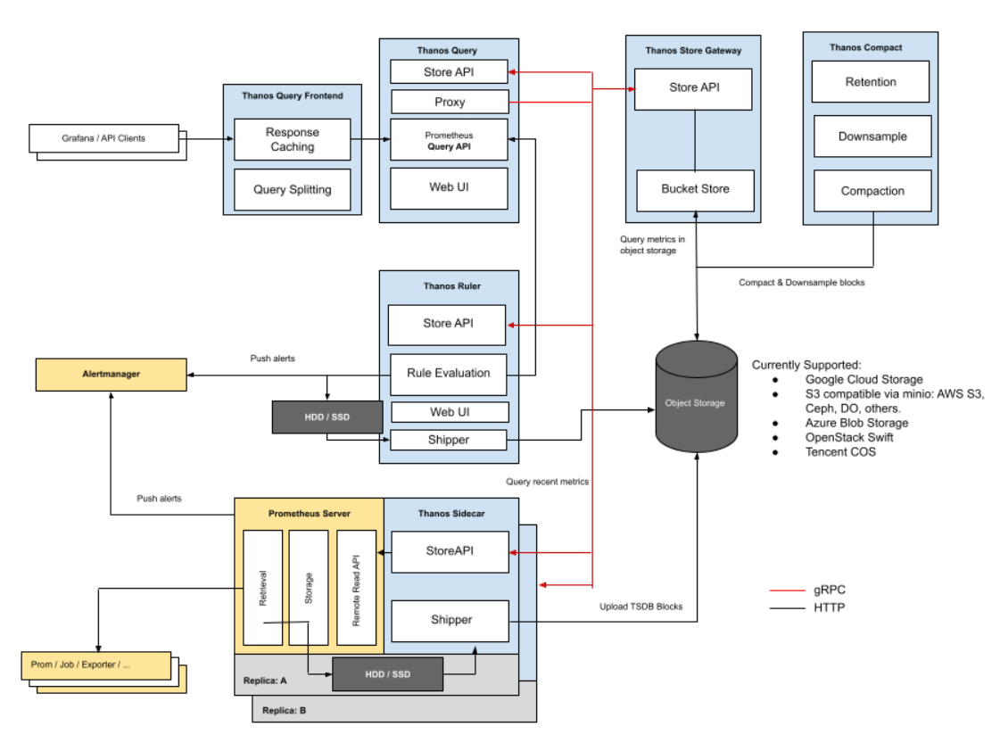

# 源码级别教程地址
- [源码级别教程地址](https://ke.qq.com/course/3883439?tuin=361e95b0)

# thanos项目总结
- sidecar架构图 

## 核心优点总结
- 无需维护存储，存储高可用： 利用廉价的公有云对象存储，高可用
- 长时间存储，数据降采样：利用Compactor降采样
- 完全适配原生prometheus查询接口：Query实现
- 多级数据缓存配置

## 怎样才能用好thanos
- 需要对prometheus 有很深入的理解
    - 包括查询的流程
    - 查询的接口
    - tsdb存储的问题
    - 数据交互的主要流程
- 如果你有很好的prometheus源码接触，再看thanos就水到渠成了。

> thanos的重点是

- 理清楚thanos每个组件存在的意思是什么
- 每个组件都干了什么
> 为什么说prometheus的源码理解很重要
- 因为thanos的每个模块都是为了解决prometheus解决不了或者解决不好的问题

# 我看thanos源码的心得
- 因为我对prometheus拿捏的死死的
- 所以thanos每个项目我都能猜到要干什么
- 再结合源码一看就清晰了

# 在调优thanos之前请先了解上面的东西
- 基础不牢，只能出一个新组件追一个，但是每个都不知道在干什么